# pytorch教程
## 1.常用类
前置工作：
* 链接主机：ssh zhouxingyu@192.168.3.72
* 环境：conda activate pytorch
**使用tensorboard查看写入log的函数:**
1. 查看命令：
   tensorboard --logdir="/home/zhangxiaohong/zhouxingyu/demo/machineLearning/logs" --port=6552

   tensorboard --logdir="E:/pythonworksation/MachineLearning/logs" --port=6552（自己的电脑）

2. （本地cmd）ssh端口转发到本地6552：
   ssh -L 6552:localhost:6552 zhouxingyu@192.168.3.72

查看cuda：
```
# 其中-n后面的1表示的是每隔多少时间（单位是s）刷新一次
watch -n 1 nvidia-smi
# 或者
nvidia-smi
```
### 1.1 函数
* dir()：查看包/函数
* help():说明
### 1.2 Tensorboard使用
```python
from PIL import Image
from numpy.distutils.tests.test_npy_pkg_config import simple
from torch.utils.tensorboard import SummaryWriter
import numpy as np

writer = SummaryWriter("logs")
image_path = "/home/zhangxiaohong/zhouxingyu/demo/data/train/ants_image/0013035.jpg"
img_PIL = Image.open(image_path)
img_array = np.array(img_PIL)
# writer.add_image()读取格式:img_tensor (torch.Tensor, numpy.ndarray, or string/blobname): Image data
writer.add_image("train", img_array, 1, dataformats='HWC')
# eg.fx=x
for i in range(100):
    # 名，y，x
    writer.add_scalar("fx=x", i, i)
writer.close()

```
**使用tensorboard查看写入log的函数:**
1.  查看命令：
tensorboard --logdir="/home/zhangxiaohong/zhouxingyu/demo/python/logs" --port=6552
2.  （本地cmd）ssh端口转发到本地6560：
ssh -L 6552:localhost:6552 zhouxingyu@192.168.3.72


### 1.3 Teansform的使用
```python
# 常用Transform
from PIL import Image
from torch.utils.tensorboard import SummaryWriter
from torchvision import transforms

writer = SummaryWriter(log_dir='./logs')
img = Image.open("dataset/train/bees_image/92663402_37f379e57a.jpg")

# 转为tensor对象
trans_totensor = transforms.ToTensor()
img_tensor = trans_totensor(img)
# def add_image(
#         self, tag, img_tensor, global_step=None, walltime=None, dataformats="CHW"
#     ):
# img_tensor需要(torch.Tensor, numpy.ndarray, or string/blobname)
writer.add_image("To tensor", img_tensor)
writer.close()

```
**常见的Transform用法：**

1. transforms.Normalize(mean=[],std=[])：output[channel] = (input[channel] - mean[channel]) / std[channel]
实现了**输入标准化**，将每个通道的值调整到分布均值为0，方差(标准差)为1 的范围内。
输出范围为[-1,1]
```python
# 提供三个均值三个标准差
# output[channel] = (input[channel] - mean[channel]) / std[channel]
# mean均值，一般取[0.485, 0.456, 0.406]（大量自然图片RGB的平均值）
# std标准差，常用为[0.229, 0.224, 0.225]（自然图片的典型标准差）
trans_norm = transforms.Normalize(mean=[0.5, 0.5, 0.5], std=[0.5, 0.5, 0.5])
img_norm = trans_norm(img_tensor)
```
标准化结果：


2. resize_transform = transforms.Resize(size,interpolation,max_size,antialias)
实现**缩放**参数：size，插值方法，最长边，是否抗锯齿
提供的是一个整数，则会根据图像的短边将其缩放到这个大小，长边则根据原始比例自动调整
如果提供的是元组（h,w)，图像直接被缩放为指定高度h和宽度w
```python
from PIL import Image
from torchvision import transforms

img = Image.open('path_to_image.jpg')  # 打开图像
resize_transform = transforms.Resize((128, 128))  # 定义 Resize 变换
img_resized = resize_transform(img)  # 应用变换
img_resized.show()  # 显示调整后的图像

```

3. transforms.RandomCrop(size,padding,pad_if_needed,fill,padding_mode)
实现**随机裁剪**，参数:
size:int表示正方形，（h，w）是高和宽
可选填充
是或自动填充（图像小于所需裁剪大小）
填充的像素值
填充的类型
4. torchvision.transforms.Compose([])
可将多个图像转换操作联立起来，根据数组的顺序执行每个变换
``` python
dataset_transform = torchvision.transforms.Compose([
    torchvision.transforms.Resize((256, 256)),  # 先调整图像大小
    torchvision.transforms.RandomHorizontalFlip(),  # 随机水平翻转
    torchvision.transforms.ToTensor(),  # 转换为 Tensor
    torchvision.transforms.Normalize(mean=[0.5, 0.5, 0.5], std=[0.5, 0.5, 0.5])  # 归一化
])
```
#### 1.3.1 tensor数据类型
多维数组，可用Numpy/列表/tensor转换
```python
import torch
tensor = torch.tensor([[1, 2, 3], [4, 5, 6]])
print(tensor.shape)  # 输出 torch.Size([2, 3])
np_array = np.array([1, 2, 3])
tensor_from_numpy = torch.tensor(np_array)  # 会自动转换为 float32 类型
original_tensor = torch.tensor([1.0, 2.0, 3.0])
new_tensor = original_tensor.float()  # 转换为 float32 类型
```
**常见的tensor数据类型：**
* torch.float32 或 torch.float
``` python 
tensor = torch.tensor([1.0, 2.0, 3.0], dtype=torch.float32)
tensor = torch.tensor([1.0, 2.0, 3.0], dtype=torch.float64)
```
* int32 或 int
``` python
tensor = torch.tensor([1, 2, 3], dtype=torch.int32)
```
**tensor操作**
``` python
# 加法
tensor1 = torch.tensor([1.0, 2.0, 3.0])
tensor2 = torch.tensor([4.0, 5.0, 6.0])
sum_tensor = tensor1 + tensor2  # 结果 tensor([5.0, 7.0, 9.0])
# 乘法
x = torch.tensor([1, 2, 3])
y = torch.tensor([4, 5, 6])
print(x * y)  # 输出 tensor([4, 10, 18])
print(torch.mul(x, y))  # 输出 tensor([4, 10, 18])
# 矩阵乘法
x = torch.tensor([[1, 2], [3, 4]])
y = torch.tensor([[5, 6], [7, 8]])
print(torch.matmul(x, y))  # 输出 tensor([[19, 22], [43, 50]])
print(x @ y)  # 结果相同

# 拼接
x = torch.tensor([[1, 2], [3, 4], [5, 6]])
y = torch.tensor([[7, 8], [9, 10], [11, 12]])
z = torch.cat([x, y], dim=0)#第0维拼接（样本数量）
print(z)
#结果为：tensor([[ 1,  2],
#        [ 3,  4],
#        [ 5,  6],
#        [ 7,  8],
#        [ 9, 10],
#        [11, 12]])
z = torch.cat([x, y], dim=1)#第1维拼接（样本特征）
print(z)
#结果为
#tensor([[ 1,  2,  7,  8],
#        [ 3,  4,  9, 10],
#        [ 5,  6, 11, 12]])

# 调整大小
x = torch.tensor([[1, 2], [3, 4]])
print(x.reshape(4))  # 输出 tensor([1, 2, 3, 4])
# 维度变化
x = torch.tensor([[[1], [2], [3]]])
print(x.squeeze())  # 输出 tensor([1, 2, 3])

x = torch.tensor([1, 2, 3])
print(x.unsqueeze(0))  # 输出 tensor([[1, 2, 3]])
# 转置
x = torch.tensor([[1, 2], [3, 4]])
# 第0个维度和第1个维度交换·	
print(x.transpose(0, 1))  # 输出 tensor([[1, 3], [2, 4]])
# tensor只有一个元素时获取
x = torch.tensor([3.14])
print(x.item())  # 输出 3.14

```
### 1.4 torchvision中数据集的使用

```python
# 常用Transform
from PIL import Image
from torch.utils.tensorboard import SummaryWriter
from torchvision import transforms

writer = SummaryWriter(log_dir='./logs')# 当前目录下log文件夹
img = Image.open("dataset/train/bees_image/92663402_37f379e57a.jpg")

# 转为tensor对象
trans_totensor = transforms.ToTensor()
img_tensor = trans_totensor(img)
# def add_image(
#         self, tag, img_tensor, global_step=None, walltime=None, dataformats="CHW"
#     ):
# img_tensor需要(torch.Tensor, numpy.ndarray, or string/blobname)
writer.add_image("To tensor", img_tensor)
writer.close()

```
**常见的Transform用法：

### 1.3 Torchvision数据集的使用
```python
writer = SummaryWriter(log_dir="log")
for i in range(10):
    img, target = test_set[i]
    writer.add_image('img', img, i)
    print(i, " ", img, " ", target)
print("done")
writer.close()
```
### 1.5 dataloader的使用
dataloader是处理和加载数据的工具。它提供了将数据集分批加载到模型中进行训练或测试的功能，支持批处理、打乱顺序（shuffle）、多线程读取等
1. 初始化：
```python
test_data = torchvision.datasets.CIFAR10("./data", train=False, transform=torchvision.transforms.ToTensor(),
                                         download=True)
                                         # batch_size：每次从数据集中# # 读取的样本数量，一个batch的大小
# shuffle：是否在每个 epoch 开始时打乱数据集中的样本顺序
# num_workers：使用多少个子进程来并行加载数据
# pin_memory：是否将加载的数据复制到 CUDA 固定内存中
# drop_last：如果true，在数据集不能被整除时，丢弃最后一个不完整的batch
test_loader = DataLoader(dataset=test_data, batch_size=4, shuffle=True, num_workers=0)
```
2. 读取
```python
for data in test_loader:
    images, targets = data
    print(images.shape, targets.shape)
    # torch.Size([4, 3, 32, 32]) 表示四张图片，每个图片3个通道（RGB），大小是32x32
    # torch.Size([4]) 表示4个标签
    print(targets)
```
3. 测试
```python
test_loader = DataLoader(dataset=test_data, batch_size=64, shuffle=False, num_workers=0)# 64个一组


writer = SummaryWriter(log_dir='./logs')
for epoch in range(2):
    step = 0
    for data in test_loader:
        images, labels = data
        writer.add_images("Epoch{}".format(epoch), images, step)
        step += 1

writer.close()
```


## 2.神经网络搭建(卷积)
### 2.1 结构
**1. 输入层**
**2. 隐藏层**
    2.1 卷积层（Conv2d）：使用卷积运算提取输入数据的局部特征。通过多个卷积核（滤波器）对输入图像进行处理，生成特征图。（几个卷积核几个特征图）
    2.2 池化层（MaxPool2d、AvgPool2d）：使用卷积运算提取输入数据的局部特征。通过多个卷积核（滤波器）对输入图像进行处理，生成特征图。
    2.3 全连接层（Linear）：将输入特征与输出特征进行线性变换。
    2.4 激活层（ReLU、Sigmoid、Tanh）：引入非线性，帮助模型学习复杂的函数。
**3. 正则化层**
	3.1 批归一化（BatchNorm）：在每个小批量中对激活值进行标准化，提高训练稳定性。
	3.2 Dropout：在训练过程中随机丢弃部分神经元，减少过拟合。
** 4.输出层**
	4.1 全连接层：用于生成最终输出，通常与激活函数结合，如 softmax 用于分类任务。
**5.损失层**
	5.1 损失函数：计算预测输出与实际标签之间的差距，如交叉熵损失、均方误差等。

### 2.2 卷积层
1. 卷积核：一个二维矩阵，当然这个二维矩阵要比输入图像的二维矩阵要小或相等，卷积核通过在输入图像的二维矩阵上不停的移动，每一次移动都进行一次乘积的求和，作为此位置的值
2.输出shape和卷积关系
*  **输入形状**：假设输入的形状为 $ (H_{in}, W_{in}) $，其中 $ H_{in} $ 和 $W_{in}$ 分别是输入的高度和宽度。
* **卷积核形状**：假设卷积核的形状为 $(H_{k}, W_{k})$，其中 $H_{k}$ 和 $W_{k}$ 分别是卷积核的高度和宽度。
* **步幅**：步幅为 $S$，它决定了卷积核每次移动的像素数。
* **填充**：填充为 $P$，它是在输入的边缘添加的额外像素层数。
输出形状 $(H_{out}, W_{out})$ 可以通过以下公式计算：
$$
H_{out} = \frac{H_{in} + 2P - H_{k}}{S} + 1
$$

$$
W_{out} = \frac{W_{in} + 2P - W_{k}}{S} + 1
$$

3. conv2d函数：

**确定了卷积核和输入**
```python
# 卷积层
import torch
import numpy as np
import torch.nn.functional as F

m, n = -8, 8
random_input = torch.tensor(np.random.randint(m, n, size=(5, 5)))
random_input = torch.reshape(random_input, (1, 1, 5, 5))  # 1batch size 1channel
print(random_input)
# 卷积核
kernel = torch.tensor(np.random.randint(0, 2, size=(3, 3)))
kernel = torch.reshape(kernel, (1, 1, 3, 3))
print(kernel)
# conv2d函数(输入，卷积核，偏置，步幅，输入边缘填充的像素数)
output = F.conv2d(random_input, kernel, bias=torch.tensor([2]), stride=1, padding=0)
print(output)
print(random_input.shape)# torch.Size([1, 1, 5, 5])
print(output.shape)# torch.Size([1, 1, 3, 3])
```

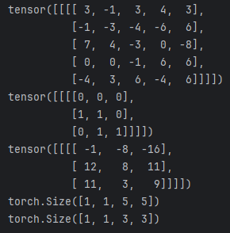
eg.对于[0，0，0，0]一次卷积操作为-1-3+4-3  +2=-1

**不定义权重矩阵时，会随机初始化**
```python
import torch
import torchvision
from torch.utils.data import DataLoader

dataset = torchvision.datasets.CIFAR10("./data", train=False, transform=torchvision.transforms.ToTensor(),
                                       download=True)
dataloader = DataLoader(dataset, batch_size=64)


class Net(torch.nn.Module):
    def __init__(self):
        super(Net, self).__init__()
        self.conv1 = torch.nn.Conv2d(3, 6, 3, stride=1, padding=0)
        # 自动生成权重矩阵,并随机初始化这些权重
        # 每个输出通道有独立的卷积核，每个卷积核的大小是3x3x3

    # 输出x
    def forward(self, x):
        x = self.conv1(x)
        return x


net = Net()

for data in dataloader:
    img, label = data
    output = net(img)
    print(img.shape)
    print(output.shape)
    # torch.Size([64, 3, 32, 32])
    # torch.Size([64, 6, 30, 30])

```

### 2.3 池化层

降低特征图维度，减少参数，控制过拟合和提取主要特征，增强特征表示的平移不变性

主要是降低运算量，也可以不使用


#### 2.3.1 常见的池化操作：
1. 最大池化：从局部区域中取最大值，通常用于保留最显著的特征。
$$
H' = \left\lfloor \frac{H + 2p - k}{s} \right\rfloor + 1
$$
输入特征图HxW，步幅s，填充p
 ```python
   # 池化窗口的大小，stride步幅，padding是否补0,dilation卷积核的扩张系数(>1则每个元素之间有间隔)
   # ceil_mode: bool输出形状默认flase向下取整（如果不够一个卷积核，就不输出池化结果了）
       def forward(self, input: Tensor):
         return F.max_pool1d(input, self.kernel_size, self.stride,
                             self.padding, self.dilation, ceil_mode=self.ceil_mode,
                             return_indices=self.return_indices)
 ```

```python
import torch
import torch.nn as nn

# 创建一个 MaxPool2d 池化层，池化窗口大小为 2x2
max_pool = nn.MaxPool2d(kernel_size=2)

# 假设输入是一个大小为 (1, 1, 4, 4) 的 4x4 图像
input_tensor = torch.tensor([[[[1., 2., 3., 4.],
                               [5., 6., 7., 8.],
                               [9., 10., 11., 12.],
                               [13., 14., 15., 16.]]]])

# 应用最大池化
output = max_pool(input_tensor)

print(output)
# 输出是 2x2，每个区域取最大值
# tensor([[[[ 6.,  8.],
#           [14., 16.]]]])

```
2. 平均池化：从局部区域中取平均值，常用于平滑特征图。
$$
W' = \left\lfloor \frac{W + 2p - k}{s} \right\rfloor + 1
$$
```python
torch.nn.AvgPool2d(kernel_size, stride=None, padding=0)
```
示例：
```python
avg_pool = nn.AvgPool2d(kernel_size=2)

output = avg_pool(input_tensor)

print(output)
# 输出是 2x2，每个区域取平均值
# tensor([[[[ 3.5000,  5.5000],
#           [11.5000, 13.5000]]]])
```
### 2.4 非线性激活
1. ReLU(): max(0,x)
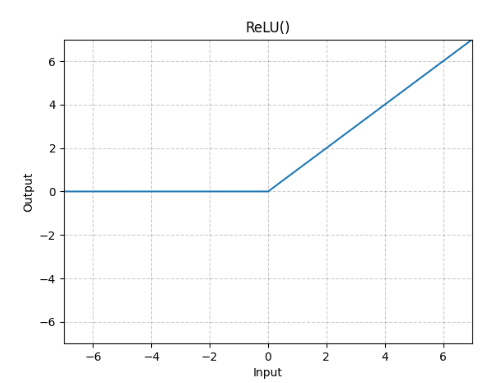
```python
  >>> m = nn.ReLU()
  >>> input = torch.randn(2)
  >>> output = m(input)

    #ReLu参数有inplace=True/False
    #True 替换原有输入 jDefault: False

An implementation of CReLU - https://arxiv.org/abs/1603.05201

  >>> m = nn.ReLU()
  >>> input = torch.randn(2).unsqueeze(0)
  >>> output = torch.cat((m(input), m(-input)))
```
2. Sigmoid(x):

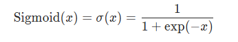

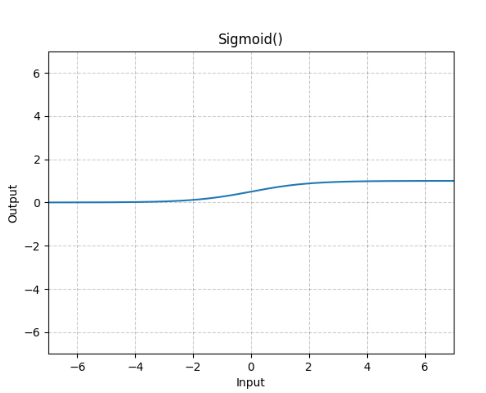
```python
m = nn.Sigmoid()
input = torch.randn(2)
output = m(input)
```
torch提供的sigmoid函数不支持参数调节，下面是自定义的sigmoid函数
```python
import torch
def custom_sigmoid(x, alpha=1.0, beta=0.0):
    return 1 / (1 + torch.exp(-alpha * (x - beta)))

# 使用示例
x = torch.tensor([0.0, 1.0, 2.0])
output = custom_sigmoid(x, alpha=2.0, beta=1.0)
print(output)
```
### 2.5线性层以及其他层
1. 归一化
卷积层后，激活函数前添加，将数据缩放到特定范围，如 [0, 1] 或 [-1, 1]。目的是使特征在相同的尺度上，从而加快收敛速度和提高训练稳定性。
对输入数据的处理：
* **计算均值和方差：** 在每个batch内，计算每个通道的均值和方差

* **标准化：**使用计算出的均值和方差做标准化，使其符合正态分布

  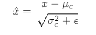
  
* **缩放和偏移（affine=True 则可学习）：**允许模型在标准化后调整输出的分布

  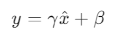
* **移动均值和方差的更新：**在训练过程中，BatchNorm2d 会维护整个训练过程中的移动均值和方差，用于评估阶段（model.eval()）时的标准化。

```python
# num_features 为输出通道数
self.bn1 = nn.BatchNorm2d(num_features=16)
```
在训练时，BatchNorm2d 会使用当前批次的均值和方差，并在评估模式下（model.eval()），使用在训练过程中计算的移动均值和方差。
2. 正则化层

3. 线性层

   线性层允许接受一维或多维输入，当输入是多维时，当输入是多维张量时，`Linear`层会对输入张量的**最后一维**进行线性变换，并且不会改变其他维度的结构。
```python
torch.nn.Linear(in_features, # 输入的神经元个数
           out_features, # 输出神经元个数
           bias=True # 是否包含偏置
           )
```
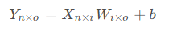
W 是模型要学习的参数
```python
# 查看模型参数
for param in model.parameters():
    print(param)
```
例子：
```python
import torch
import torchvision.datasets as datasets
from sympy.functions.elementary.tests.test_trigonometric import nn
from torch.utils.data import DataLoader
import torchvision.transforms as transforms

dataset = datasets.CIFAR10(root="./data", train=False,
                           transform=transforms.ToTensor(),
                           download=True)


class Net(nn.Module):
    def __init__(self):
        super(Net, self).__init__()
        self.linear = nn.Linear(in_features=196608, out_features=10)

    def forward(self, x):
        x = self.linear(x)
        return x


data_loader = DataLoader(dataset, batch_size=64)
for data in data_loader:
    images, targets = data
    print(images.shape)
    output = torch.reshape(images, [1, 1, 1, -1])
    # 展平 torch.flatten(images)
```

## 3.Sequential使用及神经网络实战
1. CIFAR-10数据集结构


注：Flatten后是64\*4\*4，再接两个线性层

```python
import torch
from torch import nn
from torch.ao.nn.qat import Conv2d
from torch.nn import MaxPool2d, Flatten, Linear, Conv2d


class Net(nn.Module):
    def __init__(self):
        super(Net, self).__init__()
        # self.conv1 = nn.Conv2d(3, 32, 5, padding=2)  # input 3@32x32 output 32@32x32
        # self.maxpool1 = nn.MaxPool2d(2, 2)
        # self.conv2 = nn.Conv2d(32, 32, 5, padding=2)  # input 32@16x16 output 32@16x16
        # self.maxpool2 = nn.MaxPool2d(2, 2)
        # self.conv3 = nn.Conv2d(32, 64, 5, padding=2)  # input 32@8x8 output 64@8x8
        # self.maxpool3 = nn.MaxPool2d(2, 2)
        # self.flatten = nn.Flatten()
        # self.fc1 = nn.Linear(1024, 64)
        # self.fc2 = nn.Linear(64, 10)

        self.model = nn.Sequential(
            Conv2d(3, 32, 5, padding=2),
            MaxPool2d(2, 2),
            Conv2d(32, 32, 5, padding=2),
            MaxPool2d(2, 2),
            Conv2d(32, 64, 5, padding=2),
            MaxPool2d(2, 2),
            Flatten(),
            Linear(1024, 64),
            Linear(64, 10)
        )

    def forward(self, x):
        # x = self.maxpool1(self.conv1(x))
        # x = self.maxpool2(self.conv2(x))
        # x = self.maxpool3(self.conv3(x))
        # x = self.flatten(x)
        # x = self.fc1(x)
        # x = self.fc2(x)
        x = self.model(x)
        return x


net = Net()
print(net)
input = torch.ones(64, 3, 32, 32)
output = net(input)
print(output.shape)

writer = SummaryWriter(log_dir='./logs')
writer.add_graph(net, input)
writer.close()# tensorboard --logdir="/home/zhangxiaohong/zhouxingyu/demo/python/logs" --port=6552
```

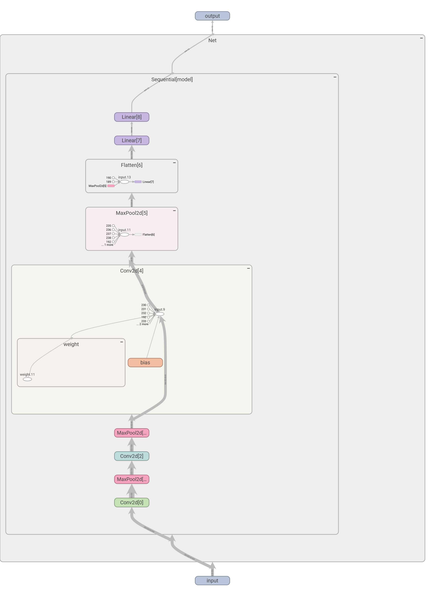

模型训练：

```python	
import torchvision.datasets
from torch.utils.data import DataLoader
from torch.utils.tensorboard import SummaryWriter
from CIFAR10QuickModel import *

# 添加tensorboard
writer = SummaryWriter('../logs')

# 数据
train_data = torchvision.datasets.CIFAR10(root='../CIFAR10_datasets', train=True, download=True,
                                          transform=torchvision.transforms.ToTensor())
test_data = torchvision.datasets.CIFAR10(root='../CIFAR10_datasets', train=False, download=True,
                                         transform=torchvision.transforms.ToTensor())
train_data_size = len(train_data)
test_data_size = len(test_data)
print(f'Train data size: {train_data_size}')
print(f'Test data size: {test_data_size}')

train_dataLoader = DataLoader(train_data, batch_size=64, shuffle=True)
test_dataLoader = DataLoader(test_data, batch_size=64, shuffle=True)

# 神经网络模型设置
device = torch.device("cuda" if torch.cuda.is_available() else "cpu")
print(f"Using device: {device}")
net = Net().to(device)
loss_fn = nn.CrossEntropyLoss().to(device)
learning_rate = 1e-2
optimizer = torch.optim.SGD(net.parameters(), lr=learning_rate)

# 参数设置
total_loss = 0
total_train_step = 0
total_test_step = 0
epoch = 20
for i in range(epoch):
    print(f'Epoch {i + 1}---------------------------------------------------------------------')
    train_loss = 0

    net.train()
    for data in train_dataLoader:
        image, labels = data
        image, labels = image.to(device), labels.to(device)
        output = net(image)
        loss = loss_fn(output, labels)

        optimizer.zero_grad()
        loss.backward()
        optimizer.step()
        train_loss += loss.item()
        total_train_step += 1
        if total_train_step % 100 == 0:
            print(f'Loss: {loss.item():.4f},total_train_step: {total_train_step}')
            writer.add_scalar('train_loss', loss.item(), total_train_step)

    # 测试
    total_test_loss = 0
    total_accuracy = 0
    net.eval()
    with torch.no_grad():
        for data in test_dataLoader:
            image, labels = data
            image, labels = image.to(device), labels.to(device)
            output = net(image)
            loss = loss_fn(output, labels)
            total_test_loss += loss.item()

            # 正确率
            accuracy = (output.argmax(dim=1) == labels).sum()
            total_accuracy += accuracy.item()

    print(f'Test Loss: {total_test_loss}')
    print(f'Test Accuracy: {total_accuracy / len(test_data)}')
    writer.add_scalar('test_loss', total_test_loss, i)
    writer.add_scalar('test_accuracy', total_accuracy, i)

    # 模型保存
    torch.save(net.state_dict(), f'../models/net_{i}.path')
writer.close()
```

准确率统计:

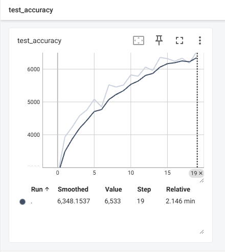

loss:

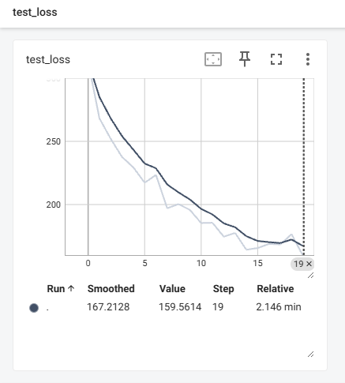

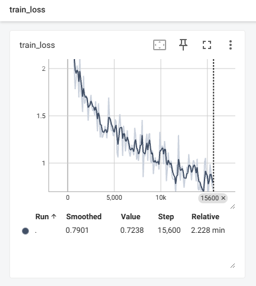

图像测试：

```python
import torchvision.transforms
from PIL import Image
from CIFAR10QuickModel import *

classes = ['airplane', 'automobile', 'bird', 'cat', 'deer', 'dog', 'frog', 'horse', 'ship', 'truck']


# mage_path = "../img/test7.jpg"


def image_test(image_path):
    # 图像转换
    image = Image.open(image_path)
    # print(image)
    image = image.convert("RGB")
    transform = torchvision.transforms.Compose(
        [torchvision.transforms.ToTensor(),
         torchvision.transforms.Normalize(mean=[0.485, 0.456, 0.406], std=[0.229, 0.224, 0.225]),
         torchvision.transforms.Resize((32, 32)), ]
    )
    image = transform(image)
    image = torch.reshape(image, (1, 3, 32, 32)).cuda()
    # print(image.shape)

    device = torch.device("cuda" if torch.cuda.is_available() else "cpu")
    # print(f"Using device: {device}")
    net = Net().to(device)
    net.load_state_dict(torch.load("../models/net_19.path"))
    outputs = net(image).argmax(dim=1)
    print(f"图片类型为：{classes[outputs[0]]}")


if __name__ == '__main__':
    for i in range(8):
        mage_path = f"../img/test{i}.jpg"
        image_test(mage_path)

```


## 4. 损失函数和反向传播
### 4.1 损失函数
**output**：实际值；**target**：真实值
1. 均方误差函数：
```python 
loss = nn.MSELoss(output, target)# 差的方/n
```
2. 绝对误差损失：
``` python
criterion = nn.L1Loss(output, target) # 相减平均值
```
3. 交叉熵损失
* 二分类交叉熵损失
$$
\text{Loss}(y, \hat{y}) = - \left[ y \log(\hat{y}) + (1 - y) \log(1 - \hat{y}) \right]
$$
$y$ 是真实标签（0 或 1），$\hat{y}$是模型预测的概率（即输入为正类的概率）
* 多分类交叉熵损失

$$
\text{Loss}(y, \hat{y}) = - \sum_{i=1}^{C} y_i \log(\hat{y}_i)
$$
C 是类别数
$y_i$是真实标签的独热编码形式（one-hot encoding），在第 𝑖 类为1，其余为0
$\hat{y}$是模型预测该类别的概率
* 组合了softmax的交叉熵公式：
``` python criterion = nn.CrossEntropyLoss() ```

softmax函数：
$$
\hat{y}_i = \frac{e^{z_i}}{\sum_{j=1}^{C} e^{z_j}} \quad \text{for } i = 1, 2, \ldots, C
$$
交叉熵损失：
$$
\text{Loss}(y, z) = - \sum_{i=1}^{C} y_i \log\left( \hat{y}_i \right) = - \sum_{i=1}^{C} y_i \log\left( \frac{e^{z_i}}{\sum_{j=1}^{C} e^{z_j}} \right)
$$

$$
\text{Loss}(y, z) = - \sum_{i=1}^{C} y_i \left( z_i - \log\left( \sum_{j=1}^{C} e^{z_j} \right) \right)
$$

$$
\text{Loss}(y, z) = - \sum_{i=1}^{C} y_i z_i + \log\left( \sum_{j=1}^{C} e^{z_j} \right)
$$
### 4.2 优化器
使用SGD优化的实例
```python
import torch
import torchvision
from torch import nn
from torch.nn import Sequential, Flatten
from torch.utils.data import DataLoader

# 检查CUDA是否可用
device = torch.device("cuda" if torch.cuda.is_available() else "cpu")
print(f"Using device: {device}")

# 加载数据集
dataset = torchvision.datasets.CIFAR10("./data", train=True, transform=torchvision.transforms.ToTensor(), download=True)
dataloader = DataLoader(dataset, batch_size=8, shuffle=True)


# 定义模型
class Net(nn.Module):
    def __init__(self):
        super(Net, self).__init__()
        self.model1 = Sequential(
            nn.Conv2d(3, 32, 5, padding=2),
            nn.MaxPool2d(2),
            nn.Conv2d(32, 32, 5, padding=2),
            nn.MaxPool2d(2),
            nn.Conv2d(32, 64, 5, padding=2),
            nn.MaxPool2d(2),
            Flatten(),
            nn.Linear(1024, 64),
            nn.Linear(64, 10)
        )

    def forward(self, x):
        x = self.model1(x)
        return x


net = Net().to(device)  # 将模型移动到GPU
loss = nn.CrossEntropyLoss()
optimizer = torch.optim.SGD(net.parameters(), lr=0.01)

for epoch in range(20):
    running_loss = 0.0
    for data in dataloader:
        image, labels = data
        image, labels = image.to(device), labels.to(device)  # 将数据移动到GPU
        outputs = net(image)
        rel_loss = loss(outputs, labels)
        optimizer.zero_grad()
        rel_loss.backward()
        optimizer.step()
        running_loss += rel_loss.item()
    print(running_loss)
```
1. 梯度下降法
设定学习率n,参数沿梯度的反方向移动，假设需要更新的参数为w，梯度为g
   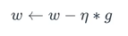
(1) 梯度下降法形式（传统梯度下降法)
* BGD：批量梯度下降，每次参数更新使用**所有样本**
* SGD：随机梯度下降，每次参数更新使用**一个样本**
* MBGD：小批量梯度下降，每次参数更新使用**小部分数据样本**
step1： 求该方法所使用的样本的loss的g
step2：求梯度的平均值
step3：更新权重
2. 多维梯度下降法

   多个参数${{X}=[{x_1},{x_2},...,{x_d}]}^T$

   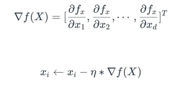

3. 带动量的梯度下降法

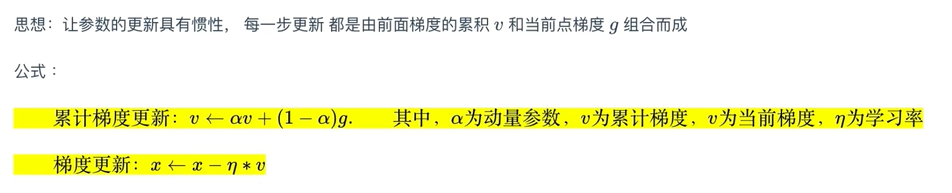

加快收敛，帮助跳出局部最小值

4. Adagrad优化算法

   因为不同的参数梯度差异可能很大，如果使用相同的学习率，效果不是很好

   方法：每个参数，初始化一个累计平方梯度r=0，每次将该参数的梯度平方求和累加到r上：

   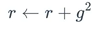

​	更新参数时，学习率变为：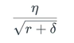
​	$\delta$是一个极小值，可设为${10^{-10}}$
​	权重更新：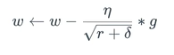，此时如果一个参数的梯度一直都很大，那么学习率变小，防止振	荡；如果一个参数的梯度很小，就让学习率变大，使其更快更新

5. RMSProp 均方根传播
    在Adagrad的基础上，进一步在学习率的方向上优化
    累计平方梯度：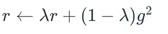
    权重更新：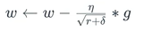

6. Adam

  	累计梯度：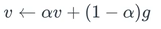
  	
  	学习率，累计平方梯度：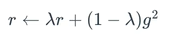

​	偏差纠正：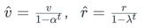

​	权重更新：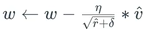

```python
def adam(learning_rate, beta1, beta2, epsilon, var, grad, v, r, t):
    v = beta1 * v + (1 - beta1) * grad
    r = beta2 * r + (1 - beta2) * grad * grad
    v_hat = v / (1 - beta1 ** t)
    r_hat = r / (1 - beta2 ** t)
    var = var - learning_rate * (v_hat / (np.sqrt(r_hat) + epsilon))
    return var, v, r
```

## 5.Python库

### 5.1 进度条（tqdm）

1.设置进度条总长度,ncols为0自动显示宽度，desc是显示在进度条前的描述，unit是单位

```python 
pbar = tqdm(total=len(dataloader.dataset), ncols=0, desc="Valid", unit=" uttr")
```

2. 更新进度条
update里面是更新长度
```python
	pbar.update(dataloader.batch_size)
```

3. 显示附加信息
`set_postfix` 用于更新进度条的后缀信息，通常用于显示训练过程中的一些实时指标，比如损失（`loss`）和准确率（`accuracy`）。每次更新时，`tqdm` 会更新进度条的状态并显示这些实时计算的结果。
```python
    pbar.set_postfix(
        loss=f"{running_loss / (i + 1):.2f}",
        accuracy=f"{running_accuracy / (i + 1):.2f}",
    )

```

## 6. 归一化

#### 6.1 Batch Normalization

计算均值和方差时，它**只会考虑当前批次中的特定特征维度**,不会跨所有特征维度进行计算。输入为`(batch_size, seq_len, d_model)`**，BN 对每一个特征维度分别计算一个均值和方差，共计算 `d_model` 个均值和方差**。

在 PyTorch 中，`BatchNorm` 系列层用于实现批量归一化。常用的是 `BatchNorm1d`、`BatchNorm2d` 和 `BatchNorm3d`，分别用于 1D、2D 和 3D 数据。下面是 `BatchNorm1d` 和 `BatchNorm2d` 的使用示例：

**1. Batch Normalizatoin**

```python
import torch
import torch.nn as nn

# 定义 BatchNorm1d 层
batch_norm1d = nn.BatchNorm1d(num_features=10)

# 创建输入数据 (batch_size, num_features)
input_data = torch.randn(32, 10)  # 假设有 32 个样本，每个样本 10 维特征

# 进行批量归一化
output_data = batch_norm1d(input_data)
print(output_data.shape)  # 输出: torch.Size([32, 10])
```

** 2. `BatchNorm2d` 示例**

`BatchNorm2d` 常用于 2D 数据，例如图像数据。通常应用于卷积层输出，它将每个特征图的像素值进行归一化。

```python
import torch
import torch.nn as nn

# 定义 BatchNorm2d 层
batch_norm2d = nn.BatchNorm2d(num_features=16)

# 创建输入数据 (batch_size, num_channels, height, width)
input_data = torch.randn(8, 16, 32, 32)  # 假设有 8 张图像，16 个通道，32x32 大小

# 进行批量归一化
output_data = batch_norm2d(input_data)
print(output_data.shape)  # 输出: torch.Size([8, 16, 32, 32])
```

`num_features`：指定要归一化的特征数量，通常为通道数（对于 `BatchNorm2d` 和 `BatchNorm3d`），或特征维度（对于 `BatchNorm1d`）。

`eps`：防止除零的小常数，默认为 `1e-5`。

`momentum`：用于移动平均的动量，默认值为 `0.1`。

`affine`：是否学习可学习的仿射参数（可训练的缩放和平移参数 `gamma` 和 `beta`），默认值为 `True`。

**3.将 BatchNorm 应用于神经网络模型 **

```python
class SimpleCNN(nn.Module):
    def __init__(self):
        super(SimpleCNN, self).__init__()
        self.conv1 = nn.Conv2d(3, 16, kernel_size=3, stride=1, padding=1)
        self.bn1 = nn.BatchNorm2d(16)  # 在卷积层之后使用 BatchNorm
        self.conv2 = nn.Conv2d(16, 32, kernel_size=3, stride=1, padding=1)
        self.bn2 = nn.BatchNorm2d(32)
        self.fc1 = nn.Linear(32 * 8 * 8, 10)
        self.bn_fc = nn.BatchNorm1d(10)  # 在全连接层之后使用 BatchNorm1d

    def forward(self, x):
        x = self.conv1(x)
        x = self.bn1(x)
        x = torch.relu(x)
        x = self.conv2(x)
        x = self.bn2(x)
        x = torch.relu(x)
        x = torch.flatten(x, 1)
        x = self.fc1(x)
        x = self.bn_fc(x)
        return x

# 创建模型和数据
model = SimpleCNN()
input_data = torch.randn(4, 3, 8, 8)  # 假设有 4 张 RGB 图像

# 前向传播
output = model(input_data)
print(output.shape)  # 输出: torch.Size([4, 10])
```

在训练模式下，`BatchNorm` 会计算当前 batch 的均值和方差，并对数据进行归一化。

在评估模式下（`model.eval()`），`BatchNorm` 会使用整个训练集的统计均值和方差（通过滑动平均计算），而不是当前 batch 的统计量。 

### 6.2 Layer Normalization

输入`(batch_size, seq_len, d_model)`，对于每个位置（每个 `batch_size` 和 `seq_len` 对应的元素），Layer Normalization 会计算**该位置所有特征维度的均值和方差**。

```python
import torch
import torch.nn as nn

# 定义 LayerNorm 层
d_model = 256
layer_norm = nn.LayerNorm(d_model)

# 创建一个形状为 (batch_size, seq_len, d_model) 的输入
input_data = torch.randn(32, 50, d_model)  # 假设 batch_size=32，序列长度 seq_len=50

# 使用 LayerNorm 归一化
output_data = layer_norm(input_data)
print(output_data.shape)  # 输出: torch.Size([32, 50, 256])
```

