## 机器学习教程

## 1.反向传播

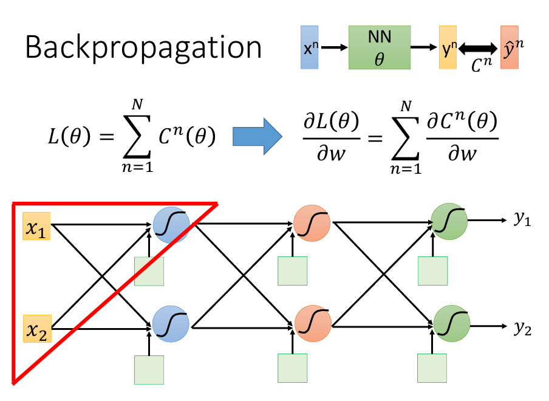

1. 要求损失函数（C）对w的导数，先考虑一个神经元$z=x_1*w_1+x_2*w_2+b$

   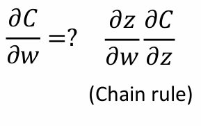

   分别求$w_1,w_2$的偏导为$x_1,x_2$

2. 又因为$\frac{\partial C}{\partial z}$不好求,可用
$$
\frac{\partial C}{\partial z}\quad=\frac{\partial a}{\partial z}\quad \frac{\partial C}{\partial a}\quad
$$

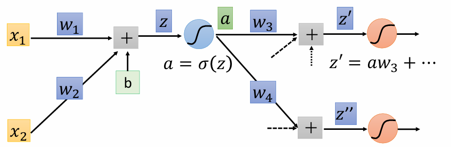

又因为
$$
\frac{\partial a}{\partial z}\quad=\partial^{'}(Z)
$$
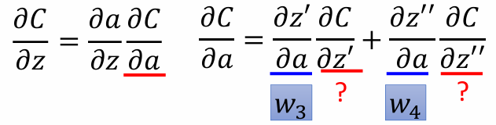

有几个神经元，$\frac{\partial C}{\partial a}\quad$就有多少项

3. 假设$\frac{\partial C}{\partial z^{'}}\quad$结果已知，算出：

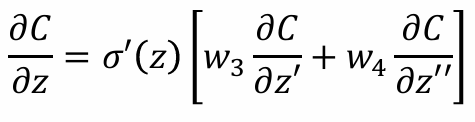

所以是反向传播：

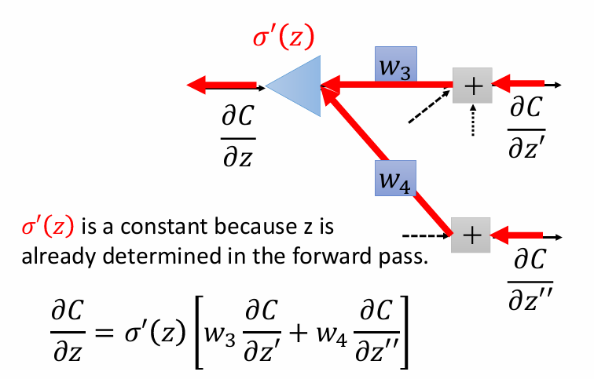

4. 假设网络就2层，输出为$y_1$，此时计算：

   

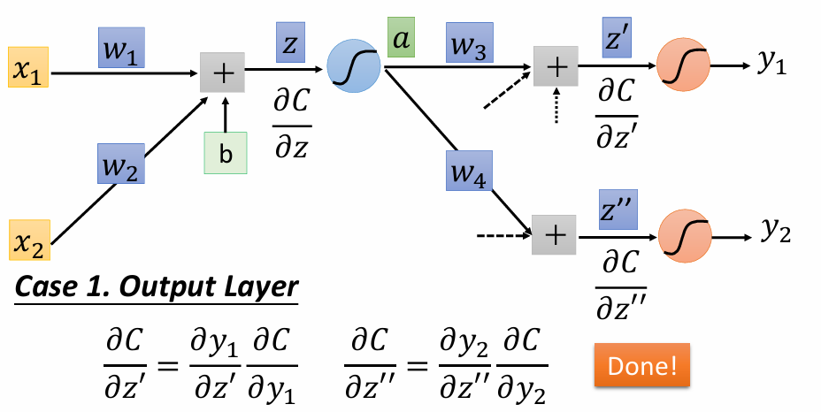

此时$\frac{\partial y_1}{\partial z^{'}}\quad$已知，就是最后神经元的导数在$z^{'}$的值（因为导数确定所以是常数），$\frac{\partial C}{\partial y_1}\quad$的值也确定了（只要确定一个losssfun都能算）

如果不是最终输入，就从下一层找

5. 反向传播：

   由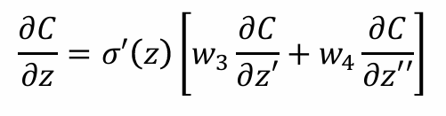，可将反向传播也看成一个逆向的神经网络，权重值就是$\sigma^{'}(Z)$，此时的输出就是$\frac{\sigma C}{\sigma z}$

   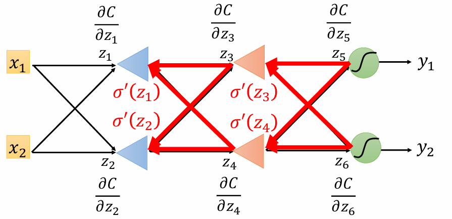

。因为前向传播时，记录了每一个激活函数的输出a($a=\frac{\sigma Z}{\sigma w}$)，想要求C对w的偏微分，只需要将$\frac{\sigma Z}{\sigma w}$和$\frac{\sigma C}{\sigma z}$相乘：

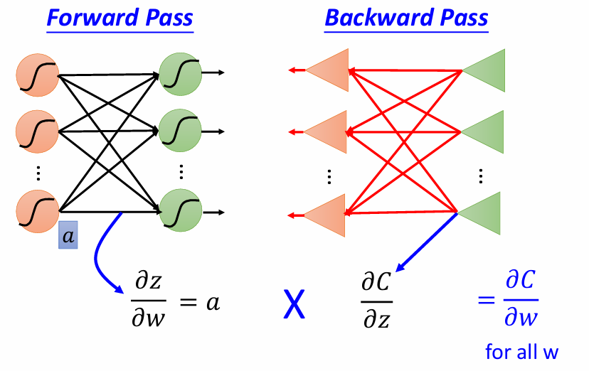

## 2.预测

1. 输入：$(x_n,\hat y_n)$

   $X$代表一只宝可梦，$X_{cp}$代表该宝可梦的cp值，$\hat y$是宝可梦进化后的cp值

2. 输出：预测

### 2.1 步骤
1. function：${b+w*{x_{cp}^n}}$
2. loss_fun:   $L(w,b)=\sum_{i=1}^{n}{({\hat y^n}-({b+w*{x_{cp}^n})})}^2$
3. Gradient Descent: 

### 2.2 处理过拟合
正则化：正则化是用来防止模型过拟合而采取的手段，对代价函数增加一个限制条件，限制其较高次的参数大小不能过大

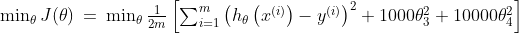

在lossfun中对$\theta_3和\theta_4$进行限制
**对模型的正则化：**
在不清楚模型中需要惩罚哪些特征的时候，对所有特征进行乘法，并让代价函数最优化的软件来选择这些惩罚的程度

* 

* L2正则化：在loss_fun的后面加上$\lambda{\Sigma(w_i)^2} $

  这样可以使绝对值大的w予以很重的惩罚，绝对值很小的予以很小的惩罚。$\lambda$的值越大，惩罚力度越大

  但过大会导致只考虑$w_0$（初始值），导致欠拟合。

## 3.分类
### 3.1 用线性判别分析(LDA)解决二分类问题
1. **二分类问题：**
loss定义：$L(f)=\sum_{n}{\delta(f(x^n)\neq{\hat y^{n}})}$ 预测错误次数和
2. **根据贝叶斯定理计算新样本x属于每个类别k的后验概率**

​	多元高斯分布的概率密度函数：

$$
f(\mathbf{x}) = \frac{1}{(2\pi)^{d/2} |\Sigma|^{1/2}} \exp\left( -\frac{1}{2} (\mathbf{x} - \boldsymbol{\mu})^T \Sigma^{-1} (\mathbf{x} - \boldsymbol{\mu}) \right)
$$

x是样本，$\mu$是d维的**均值向量**表示高斯的中心位置，下面是一种估计方法

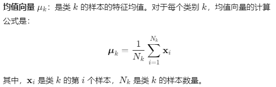

$\Sigma$是dxd的**协方差矩阵**，表示不同维度之间的相关性和每个维度的方差，下面是一种估计方法

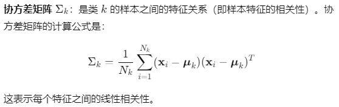

$|\Sigma|$是协方差矩阵的行列式，表示协方差矩阵的体积，假设所有类别具有相同的协方差矩阵（同方差性）

$(\mathbf{x} - \boldsymbol{\mu})^T \Sigma^{-1} (\mathbf{x} - \boldsymbol{\mu})$是马氏距离，表示x到$\mu$的距离

3. **计算**

   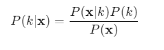

   $P(x|k)$是类别k的**高斯概率密度函数**，意思是在类别k中出现x的概率

   $P(k)$是k的先验概率，通常是**该类样本在整个数据集中的比例**

   $P(X)$是所有类别的总概率，通常在LDA分类时无需计算，因为它对所有类别是一样的

   

4. **分类**

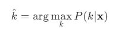

### 3.2由朴素贝叶斯到sigmoid
1. 二分类问题中每个类的概率

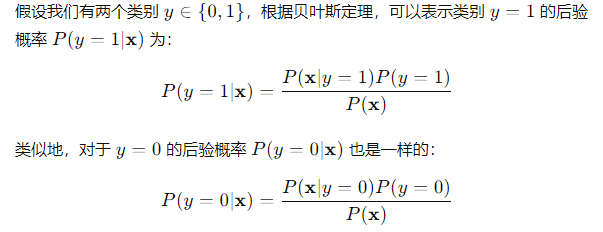

* $P(y=1|X)$是给定特征x后，样本属于1类的后验概率
* $P(X|y=1)$是在类别1中x出现的概率
* $P(y=1)$是类别1出现的先验概率
* $P(x)$是特征x出现的总概率

2. 引入朴素贝叶斯处理$P(X)$

   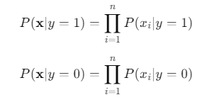

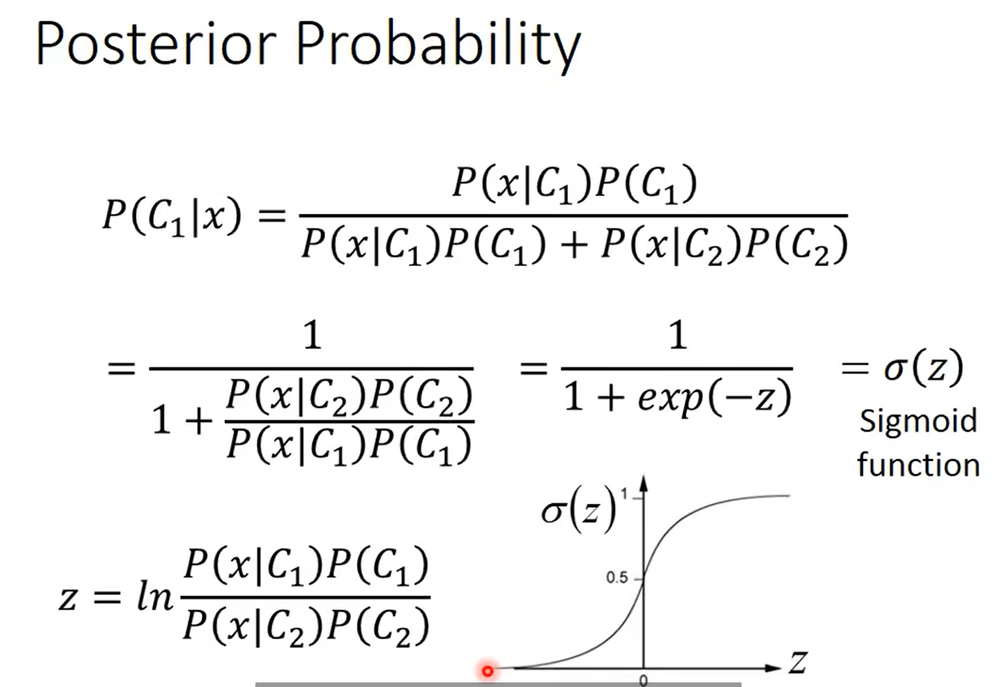

**计算：**这里的$P(x|C_1)$依然用高斯概率密度函数计算，所以：
$$
P(x|C_1) = \frac{1}{(2\pi)^{d/2} |\Sigma^1|^{1/2}} \exp\left( -\frac{1}{2} (\mathbf{x} - \boldsymbol{\mu^1})^T ({\Sigma^{1}})^{-1} (\mathbf{x} - \boldsymbol{\mu^1}) \right)
$$

$$
P(x|C_2) = \frac{1}{(2\pi)^{d/2} |\Sigma^2|^{1/2}} \exp\left( -\frac{1}{2} (\mathbf{x} - \boldsymbol{\mu^2})^T ({\Sigma^{2}})^{-1} (\mathbf{x} - \boldsymbol{\mu^2}) \right)
$$
假设$\Sigma_1和\Sigma_2$相等,化简:

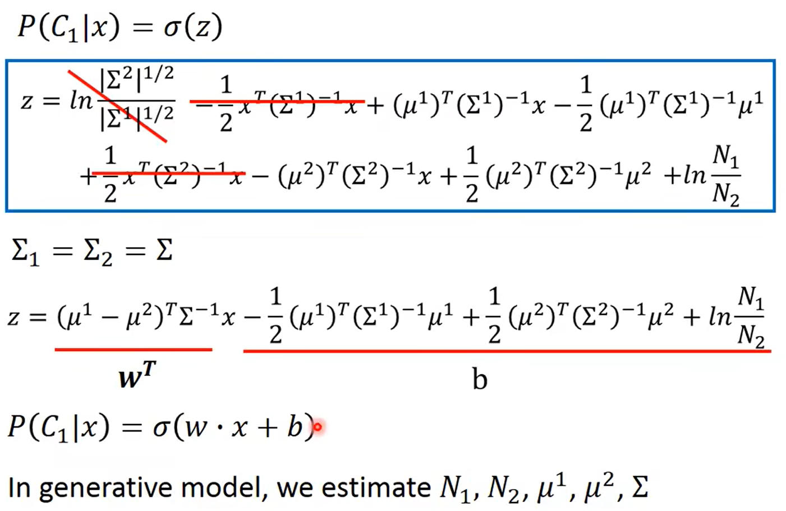

所以变成关于x的线性函数，只需要找到W和b

## 4.逻辑回归

### 4.1 设定模型 

由3，设置函数
$$
f_{w,b}(x)=P_{w,b}(C_1|x)
$$
函数由w,b控制，函数值表示x属于$C_1$的概率

**多特征值下**，函数变为(这里一个函数都是算的属于$C_1$的概率
$$
f_{w,b}(x)=\sigma(\sum_i{w_ix_i}+b)
$$
将$w_i$和$b$合起来做为向量$\theta$(大小为d+1)，拥有d个特征值的样本x大小也拓展为x+1(加1),概率模型变为：


### 4.2定义似然函数 

1. 整个数据集的**似然函数$L(\theta)$**为各样本概率的乘积：

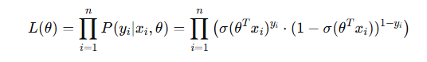

* 注：这里的样本概率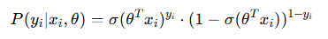并不是相乘，当$y_i$=1时，取前面项（属于1类的概率)，$y_i=0$的时候，取后面项（属于0类的概率)

2. 为了计算方便，取**对数似然函数**的相反数

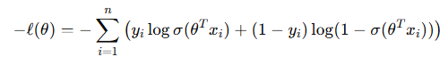

​	该函数也是**二分交叉熵损失函数**

3. **最小化二分交叉熵损失函数**

​	梯度下降法：

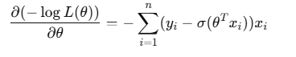

* $y_i$表示目标类别，$y_i-\sigma(\theta^Tx_i)$是当前参数下模型预测与真实标签之间的差异

### 4.3 生成式模型和判别式模型

* LDA假设每个类别的特征分布遵循多元正态分布，并尝试建模每个类别的生成过程。训练出的参数（均值、协方差和先验概率）是基于训练数据直接计算得到的，通常是固定的。
* 逻辑回归直接建模类别条件概率 $P(y∣x)$。它通过sigmoid函数（逻辑函数）将线性组合的结果转化为概率值，适用于二分类问题。

## 5. 学习结果验证

### 5.1 鞍点/局部最小值点

局部最小值和鞍点的梯度都为0，可以计算Hessian 矩阵（损失函数的二阶导数）
如果 Hessian 在该点是正定（全大于0）的，则是局部最小值；如果是负定的，则是局部最大值；如果是半正定的，则可能是鞍点

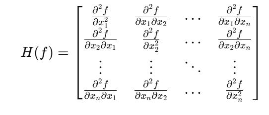


### 5.2 batch/momentum(动量)
batchsize与结果关系：
1. 训练速度：
* 小批量数据小，更新次数多，慢
* 大批量数据多，更新次数少，快（gpu的平行运算）
2. 模型性能
* 小批量训练可能引入更多噪声，减少过拟合风险，有助于逃离局部最小值，损失函数波动性较大，在结果表现一般更好
* 大批量容易收敛到局部最小值，增加过拟合风险，训练过程稳定
### 5.3 自动调整学习率
1. 不同模型对学习率的影响：详见pytorch-优化器选择
	过程：**SGD-Adagrad-RMSprop-Adam**
2. 学习率调整
* StepLR：每经过一定的 epoch 数，学习率减少一个固定的比例
* ExponentialLR：学习率按照指数函数衰减
* CosineAnnealingLR：学习率在一定周期内按照余弦函数变化
```python
from torch.optim import lr_scheduler

scheduler = lr_scheduler.StepLR(optimizer, step_size=30, gamma=0.1)
# scheduler = lr_scheduler.ExponentialLR(optimizer, gamma=0.95)
# scheduler = lr_scheduler.CosineAnnealingLR(optimizer, T_max=50)
for epoch in range(num_epochs):
    # 训练代码
    scheduler.step()  # 更新学习率

```
* **热身：上升-平稳-下降**
```python
import torch
import torch.optim as optim
import torch.optim.lr_scheduler as lr_scheduler

# 定义优化器和学习率调度器
model = YourModel()
optimizer = optim.SGD(model.parameters(), lr=0.1)
scheduler = lr_scheduler.StepLR(optimizer, step_size=1, gamma=0.1)
 
# 学习率预热参数
warmup_epochs = 5
warmup_lr_init = 0.01
warmup_lr_end = 0.1

# 在训练循环中更新学习率
for epoch in range(warmup_epochs):
    # 计算当前预热阶段的学习率
    warmup_lr = warmup_lr_init + (warmup_lr_end - warmup_lr_init) * epoch / warmup_epochs
    
    # 设置当前阶段的学习率
    for param_group in optimizer.param_groups:
        param_group['lr'] = warmup_lr
    
    # 训练模型的代码
    
    # 更新学习率调度器
    scheduler.step()

# 正常训练阶段，学习率衰减
for epoch in range(warmup_epochs, num_epochs):
    # 训练模型的代码
    
    # 更新学习率调度器
    scheduler.step()

```

## 6. HW2模型改进

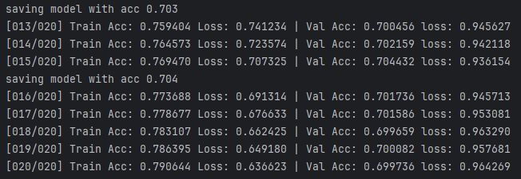

出现了过拟合问题

HW2是多分类问题，基础模型为：

```python
# 模型
class Classifier(nn.Module):
    def __init__(self):
        super(Classifier, self).__init__()
        self.layer1 = nn.Linear(429, 1024)
        self.layer2 = nn.Linear(1024, 512)
        self.layer3 = nn.Linear(512, 128)
        self.out = nn.Linear(128, 39)

        self.act_fn = nn.ReLU()

    def forward(self, x):
        x = self.layer1(x)
        x = self.act_fn(x)

        x = self.layer2(x)
        x = self.act_fn(x)

        x = self.layer3(x)
        x = self.act_fn(x)

        x = self.out(x)

        return x
```


### 6.1 Batch Normalization

**问题：**使用饱和激活函数时，例如sigmoid，tanh激活函数，随着训练，参数$w_i$会大，此时$z_i$也会变得很大，容易进入梯度饱和区，此时梯度变得很小或接近于0，影响参数的更新速度，进而放慢网络的更新速度

**解决方法：**
1. 更换非饱和性激活函数(ReLu)
2. 使用Normalization使输入分布保持在一个稳定状态

**Batch Normalization：**

工作原理：

* 输入数据标准化处理，使得均值为0，标准差为1：

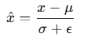

* 标准化的输出进行线性变换：

  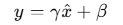
  其中$\gamma$和$\beta$都是可学习参数

## 6.2 Drop Out

DropOut是一种正则化技术，用于防止神经网络的过拟合

**工作原理**：

- 在每个训练迭代中，以一定的概率（如 0.5）随机选择一部分神经元将其输出设为零（即丢弃该神经元）。
- 在测试阶段，所有神经元都被使用，但输出会乘以保留概率（dropout rate），以确保训练和测试时的输出一致。

## 6.3 修改后模型

```python
class Classifier(nn.Module):
    def __init__(self):
        super(Classifier, self).__init__()
        self.layer1 = nn.Linear(429, 1024)
        # 添加归一化
        self.bn1 = nn.BatchNorm1d(1024)
        # 添加正则化
        self.dropout1 = nn.Dropout(p=0.5)
        self.layer2 = nn.Linear(1024, 512)
        self.bn2 = nn.BatchNorm1d(512)
        self.dropout2 = nn.Dropout(p=0.5)
        self.layer3 = nn.Linear(512, 128)
        self.bn3 = nn.BatchNorm1d(128)
        self.dropout3 = nn.Dropout(p=0.5)
        self.out = nn.Linear(128, 39)

        self.act_fn = nn.ReLU()

    def forward(self, x):
        x = self.layer1(x)
        x = self.bn1(x)
        x = self.dropout1(x)
        x = self.act_fn(x)

        x = self.layer2(x)
        x = self.bn2(x)
        x = self.dropout2(x)
        x = self.act_fn(x)

        x = self.layer3(x)
        x = self.bn3(x)
        x = self.dropout3(x)
        x = self.act_fn(x)

        x = self.out(x)

        return x
    #......#
    # 参数设置
num_epoch = 30               # number of training epoch
# 学习率热身
learning_rate = 0.0001       # learning rate
warmup_steps = 8

# 模型保存地址
model_path = '../hw/2/model_moregood.ckpt'

# 定义模型，loss_fun，优化器
model = Classifier().to(device)
criterion = nn.CrossEntropyLoss()
optimizer = torch.optim.Adam(model.parameters(), lr=learning_rate)
# 学习率调度器，lr_lambda返回一个浮动因子，lr=该因子*lr
scheduler = torch.optim.lr_scheduler.LambdaLR(optimizer,
            lr_lambda=lambda step: min(1, step / warmup_steps) if step < warmup_steps else 1)# 训练的时候scheduler.step()
    
```

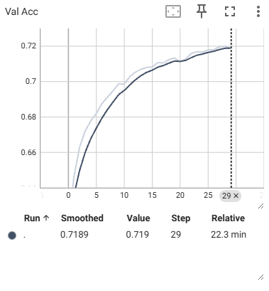

没有出现过拟合，最后结果为0.72

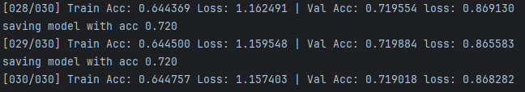