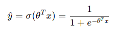

## 机器学习教程

## 1.反向传播


1. 要求损失函数（C）对w的导数，先考虑一个神经元$z=x_1*w_1+x_2*w_2+b$

   

   分别求$w_1,w_2$的偏导为$x_1,x_2$

2. 又因为$\frac{\partial C}{\partial z}$不好求,可用
$$
\frac{\partial C}{\partial z}\quad=\frac{\partial a}{\partial z}\quad \frac{\partial C}{\partial a}\quad
$$


又因为
$$
\frac{\partial a}{\partial z}\quad=\partial^{'}(Z)
$$


有几个神经元，$\frac{\partial C}{\partial a}\quad$就有多少项

3. 假设$\frac{\partial C}{\partial z^{'}}\quad$结果已知，算出：


所以是反向传播：


4. 假设网络就2层，输出为$y_1$，此时计算：

   


此时$\frac{\partial y_1}{\partial z^{'}}\quad$已知，就是最后神经元的导数在$z^{'}$的值（因为导数确定所以是常数），$\frac{\partial C}{\partial y_1}\quad$的值也确定了（只要确定一个losssfun都能算）

如果不是最终输入，就从下一层找

5. 反向传播：

   由，可将反向传播也看成一个逆向的神经网络，权重值就是$\sigma^{'}(Z)$，此时的输出就是$\frac{\sigma C}{\sigma z}$

   

。因为前向传播时，记录了每一个激活函数的输出a($a=\frac{\sigma Z}{\sigma w}$)，想要求C对w的偏微分，只需要将$\frac{\sigma Z}{\sigma w}$和$\frac{\sigma C}{\sigma z}$相乘：


## 2.预测

1. 输入：$(x_n,\hat y_n)$

   $X$代表一只宝可梦，$X_{cp}$代表该宝可梦的cp值，$\hat y$是宝可梦进化后的cp值

2. 输出：预测

### 2.1 步骤
1. function：${b+w*{x_{cp}^n}}$
2. loss_fun:   $L(w,b)=\sum_{i=1}^{n}{({\hat y^n}-({b+w*{x_{cp}^n})})}^2$
3. Gradient Descent: 

### 2.2 处理过拟合
正则化：正则化是用来防止模型过拟合而采取的手段，对代价函数增加一个限制条件，限制其较高次的参数大小不能过大


在lossfun中对$\theta_3和\theta_4$进行限制
**对模型的正则化：**
在不清楚模型中需要惩罚哪些特征的时候，对所有特征进行乘法，并让代价函数最优化的软件来选择这些惩罚的程度

* 

* L2正则化：在loss_fun的后面加上$\lambda{\Sigma(w_i)^2} $

  这样可以使绝对值大的w予以很重的惩罚，绝对值很小的予以很小的惩罚。$\lambda$的值越大，惩罚力度越大

  但过大会导致只考虑$w_0$（初始值），导致欠拟合。

## 3.分类
### 3.1 用线性判别分析(LDA)解决二分类问题
1. **二分类问题：**
loss定义：$L(f)=\sum_{n}{\delta(f(x^n)\neq{\hat y^{n}})}$ 预测错误次数和
2. **根据贝叶斯定理计算新样本x属于每个类别k的后验概率**

​	多元高斯分布的概率密度函数：

$$
f(\mathbf{x}) = \frac{1}{(2\pi)^{d/2} |\Sigma|^{1/2}} \exp\left( -\frac{1}{2} (\mathbf{x} - \boldsymbol{\mu})^T \Sigma^{-1} (\mathbf{x} - \boldsymbol{\mu}) \right)
$$

x是样本，$\mu$是d维的**均值向量**表示高斯的中心位置，下面是一种估计方法


$\Sigma$是dxd的**协方差矩阵**，表示不同维度之间的相关性和每个维度的方差，下面是一种估计方法


$|\Sigma|$是协方差矩阵的行列式，表示协方差矩阵的体积，假设所有类别具有相同的协方差矩阵（同方差性）

$(\mathbf{x} - \boldsymbol{\mu})^T \Sigma^{-1} (\mathbf{x} - \boldsymbol{\mu})$是马氏距离，表示x到$\mu$的距离

3. **计算**

   

   $P(x|k)$是类别k的**高斯概率密度函数**，意思是在类别k中出现x的概率

   $P(k)$是k的先验概率，通常是**该类样本在整个数据集中的比例**

   $P(X)$是所有类别的总概率，通常在LDA分类时无需计算，因为它对所有类别是一样的

   

4. **分类**


### 3.2由朴素贝叶斯到sigmoid
1. 二分类问题中每个类的概率


* $P(y=1|X)$是给定特征x后，样本属于1类的后验概率
* $P(X|y=1)$是在类别1中x出现的概率
* $P(y=1)$是类别1出现的先验概率
* $P(x)$是特征x出现的总概率

2. 引入朴素贝叶斯处理$P(X)$

   


**计算：**这里的$P(x|C_1)$依然用高斯概率密度函数计算，所以：
$$
P(x|C_1) = \frac{1}{(2\pi)^{d/2} |\Sigma^1|^{1/2}} \exp\left( -\frac{1}{2} (\mathbf{x} - \boldsymbol{\mu^1})^T ({\Sigma^{1}})^{-1} (\mathbf{x} - \boldsymbol{\mu^1}) \right)
$$

$$
P(x|C_2) = \frac{1}{(2\pi)^{d/2} |\Sigma^2|^{1/2}} \exp\left( -\frac{1}{2} (\mathbf{x} - \boldsymbol{\mu^2})^T ({\Sigma^{2}})^{-1} (\mathbf{x} - \boldsymbol{\mu^2}) \right)
$$
假设$\Sigma_1和\Sigma_2$相等,化简:


所以变成关于x的线性函数，只需要找到W和b

## 4.逻辑回归

### 4.1 设定模型 

由3，设置函数
$$
f_{w,b}(x)=P_{w,b}(C_1|x)
$$
函数由w,b控制，函数值表示x属于$C_1$的概率

**多特征值下**，函数变为(这里一个函数都是算的属于$C_1$的概率
$$
f_{w,b}(x)=\sigma(\sum_i{w_ix_i}+b)
$$
将$w_i$和$b$合起来做为向量$\theta$(大小为d+1)，拥有d个特征值的样本x大小也拓展为x+1(加1),概率模型变为：



### 4.2定义似然函数 

1. 整个数据集的**似然函数$L(\theta)$**为各样本概率的乘积：


* 注：这里的样本概率并不是相乘，当$y_i$=1时，取前面项（属于1类的概率)，$y_i=0$的时候，取后面项（属于0类的概率)

2. 为了计算方便，取**对数似然函数**的相反数


​	该函数也是**二分交叉熵损失函数**

3. **最小化二分交叉熵损失函数**

​	梯度下降法：


* $y_i$表示目标类别，$y_i-\sigma(\theta^Tx_i)$是当前参数下模型预测与真实标签之间的差异

### 4.3 生成式模型和判别式模型

* LDA假设每个类别的特征分布遵循多元正态分布，并尝试建模每个类别的生成过程。训练出的参数（均值、协方差和先验概率）是基于训练数据直接计算得到的，通常是固定的。
* 逻辑回归直接建模类别条件概率 $P(y∣x)$。它通过sigmoid函数（逻辑函数）将线性组合的结果转化为概率值，适用于二分类问题。

## 5. 学习结果验证

### 5.1 鞍点/局部最小值点

局部最小值和鞍点的梯度都为0，可以计算Hessian 矩阵（损失函数的二阶导数）
如果 Hessian 在该点是正定（全大于0）的，则是局部最小值；如果是负定的，则是局部最大值；如果是半正定的，则可能是鞍点


### 5.2 batch/momentum(动量)
batchsize与结果关系：
1. 训练速度：
* 小批量数据小，更新次数多，慢
* 大批量数据多，更新次数少，快（gpu的平行运算）
2. 模型性能
* 小批量训练可能引入更多噪声，减少过拟合风险，有助于逃离局部最小值，损失函数波动性较大，在结果表现一般更好
* 大批量容易收敛到局部最小值，增加过拟合风险，训练过程稳定
### 5.3 自动调整学习率
1. 不同模型对学习率的影响：详见pytorch-优化器选择
	过程：**SGD-Adagrad-RMSprop-Adam**
2. 学习率调整
* StepLR：每经过一定的 epoch 数，学习率减少一个固定的比例
* ExponentialLR：学习率按照指数函数衰减
* CosineAnnealingLR：学习率在一定周期内按照余弦函数变化
```python
from torch.optim import lr_scheduler

scheduler = lr_scheduler.StepLR(optimizer, step_size=30, gamma=0.1)
# scheduler = lr_scheduler.ExponentialLR(optimizer, gamma=0.95)
# scheduler = lr_scheduler.CosineAnnealingLR(optimizer, T_max=50)
for epoch in range(num_epochs):
    # 训练代码
    scheduler.step()  # 更新学习率

```
* **热身：上升-平稳-下降**
```python
import torch
import torch.optim as optim
import torch.optim.lr_scheduler as lr_scheduler

# 定义优化器和学习率调度器
model = YourModel()
optimizer = optim.SGD(model.parameters(), lr=0.1)
scheduler = lr_scheduler.StepLR(optimizer, step_size=1, gamma=0.1)
 
# 学习率预热参数
warmup_epochs = 5
warmup_lr_init = 0.01
warmup_lr_end = 0.1

# 在训练循环中更新学习率
for epoch in range(warmup_epochs):
    # 计算当前预热阶段的学习率
    warmup_lr = warmup_lr_init + (warmup_lr_end - warmup_lr_init) * epoch / warmup_epochs
    
    # 设置当前阶段的学习率
    for param_group in optimizer.param_groups:
        param_group['lr'] = warmup_lr
    
    # 训练模型的代码
    
    # 更新学习率调度器
    scheduler.step()

# 正常训练阶段，学习率衰减
for epoch in range(warmup_epochs, num_epochs):
    # 训练模型的代码
    
    # 更新学习率调度器
    scheduler.step()

```

#### 5.3.1 学习率热身+余弦退火

```python
def get_cosine_schedule_with_warmup(
        optimizer: Optimizer,
        num_warmup_steps: int,
        num_training_steps: int,
        # 学习率衰减的波动次数（这里是学习率减少一次，达到0）
        num_cycles: float = 0.5,
        last_epoch: int = -1,
):


    def lr_lambda(current_step):
        # 学习率热身
        if current_step < num_warmup_steps:
            return float(current_step) / float(max(1, num_warmup_steps))
        # 余弦退火
        progress = float(current_step - num_warmup_steps) / float(
            max(1, num_training_steps - num_warmup_steps)
        )
        return max(
            # 余弦函数的输出范围是[-1.1],调整为[0，1]
            0.0, 0.5 * (1.0 + math.cos(math.pi * float(num_cycles) * 2.0 * progress))
        )

    return LambdaLR(optimizer, lr_lambda, last_epoch)

```


## 6. 卷积神经网络(CNN)
**感受野：**在对图片进行分析时，往往不需要整张照片作为输入(那样会导致参数过多)，所以可以将图片的一部分作为输入，他们被称为**感受野**

**卷积：**每一个感受野的神经元处理内容都差不多，所以在**整个输入图像上使用相同的参数（权重）**，而不是为每个位置都学习不同的参数。此时就是对图像**卷积**

## 7. 自注意力机制

解决问题：输入是一组向量，长度会改变（文字处理）

输入-输出情况：
1. 1-1：每一个向量都有一个标签（词性标注）
2. n-1：整个序列只有一个标签（情感倾向判断）
3. n-n：模型自己决定标签序列（GPT）

下面讨论第一种情况
### 7.1 SequnceLebeling
* **输入：**自注意机制的输入通常是一个序列，每个元素用一个向量表示（例如，单词的嵌入表示）
* **输出：**考虑了所有输出的一组向量

机制：
	1.使用$\alpha$表示$a_i$和其他向量的相关程度
$$
q^i=W^qa^i
$$

$$
k^i=W^ka^i
$$


​	

 2. **生成查询、键、值向量值：**对于输入序列中的每个元素，使用可学习的线性变换生成查询（Query）、键（Key）和值（Value）向量：

    

 3. 计算注意力权重：

    

    

4. 加权求和：


$$
b^1=\sum_i{{a^{'}_{1,i}}}{v^i}
$$


   

   可以看到，Self Attention在计算过程中会直接将句子中任意两个单词的联系通过一个计算步骤直接联系起来，所以远距离依赖特征之间的距离被极大缩短，有利于有效地利用这些特征。

### 7.2 多头注意力机制

多头机制是对自注意力机制的扩展。通过并行计算多个不同的注意力头，可以捕捉输入中更丰富的信息。


输入分头：输入向量长度一般是`embe_size`,每个头的维度是`head_dim = embed_size / num_heads`

线性变换后，矩阵$W_Q,W_k,W_V$大小为`[embed_size,head_dim]`，每个头的维度输出是`head_dim`

每个头都有一组独立的线性变换权重 `W_Q`, `W_K`, `W_V`，用于生成查询、键和值。


### 7.3 位置编码

输入有关位置的信息在某些问题中也很重要：

* 为每一个位置设置单独的位置向量$e^i$，并将它加到$a^i$上


### 7.4 结合了多头自注意力机制和卷积的Conformer结构


Conformer的每个编码器块按以下顺序排列了各个模块：

1. **前馈模块**（Feed Forward Module）：Conformer层中的前馈模块放在第一层。
2. **多头自注意力模块**（Multi-Head Self Attention Module）：在前馈模块之后，用于建模全局依赖。
3. **卷积模块**（Convolution Module）：多头自注意力模块之后，卷积模块用来提取局部特征。
4. **第二个前馈模块**：位于最后的前馈模块，通常与第一个前馈模块类似。
5. **LayerNorm**：一般在每个模块之间使用LayerNorm，以及通过残差连接进行规范化。

```python
import torch
import torch.nn as nn
import torch.nn.functional as F
from torch.nn import MultiheadAttention, Conv1d, LayerNorm, Dropout

# 前馈模块
class FeedForwardModule(nn.Module):
    def __init__(self, d_model, dim_feedforward, dropout=0.1):
        super(FeedForwardModule, self).__init__()
        self.linear1 = nn.Linear(d_model, dim_feedforward)
        self.dropout = nn.Dropout(dropout)
        self.linear2 = nn.Linear(dim_feedforward, d_model)

    def forward(self, x):
        return self.dropout(self.linear2(F.relu(self.linear1(x))))
    
# 卷积模块
class ConvolutionModule(nn.Module):
    def __init__(self, d_model, dropout=0.1):
        super(ConvolutionModule, self).__init__()
        self.pointwise_conv1 = Conv1d(d_model, d_model * 2, kernel_size=1)
        self.depthwise_conv = Conv1d(d_model * 2, d_model * 2, kernel_size=3, padding=1, groups=d_model * 2)
        self.batch_norm = nn.BatchNorm1d(d_model * 2)
        self.pointwise_conv2 = Conv1d(d_model * 2, d_model, kernel_size=1)
        self.dropout = Dropout(dropout)

    def forward(self, x):
        # x shape: (seq_len, batch_size, d_model)
        x = x.transpose(0, 1).transpose(1, 2)  # to (batch_size, d_model, seq_len)
        x = F.glu(self.pointwise_conv1(x), dim=1)
        x = self.batch_norm(self.depthwise_conv(x))
        x = F.relu(x)
        x = self.dropout(self.pointwise_conv2(x))
        x = x.transpose(1, 2).transpose(0, 1)  # back to (seq_len, batch_size, d_model)
        return x
    
# Conformer块
class ConformerBlock(nn.Module):
    def __init__(self, d_model, nhead, dim_feedforward, dropout=0.1):
        super(ConformerBlock, self).__init__()
        self.norm1 = LayerNorm(d_model)
        self.feed_forward1 = FeedForwardModule(d_model, dim_feedforward, dropout)
        
        self.norm2 = LayerNorm(d_model)
        self.self_attn = MultiheadAttention(d_model, nhead, dropout=dropout)
        
        self.norm3 = LayerNorm(d_model)
        self.conv_module = ConvolutionModule(d_model, dropout)
        
        self.norm4 = LayerNorm(d_model)
        self.feed_forward2 = FeedForwardModule(d_model, dim_feedforward, dropout)
        
        self.dropout = Dropout(dropout)

    def forward(self, src, src_mask=None, src_key_padding_mask=None):
        # First Feed Forward Module with residual connection
        src = src + 0.5 * self.dropout(self.feed_forward1(self.norm1(src)))

        # 多头自注意力模块的三个src分别代表Q，K，V
        src2 = self.self_attn(src, src, src, attn_mask=src_mask, key_padding_mask=src_key_padding_mask)[0]# 返回的是一个元组, (attn_output,attn_weights)
        src = src + self.dropout(src2)
        src = self.norm2(src)

        # Convolution Module with residual connection
        src = src + self.dropout(self.conv_module(self.norm3(src)))

        # Second Feed Forward Module with residual connection
        src = src + 0.5 * self.dropout(self.feed_forward2(self.norm4(src)))

        return src

class ConformerEncoder(nn.Module):
    def __init__(self, d_model=256, nhead=4, num_layers=6, dim_feedforward=512, dropout=0.1):
        super(ConformerEncoder, self).__init__()
        self.layers = nn.ModuleList([
            ConformerBlock(d_model, nhead, dim_feedforward, dropout)
            for _ in range(num_layers)
        ])
        self.norm = LayerNorm(d_model)

    def forward(self, src, src_mask=None, src_key_padding_mask=None):
        for layer in self.layers:
            src = layer(src, src_mask=src_mask, src_key_padding_mask=src_key_padding_mask)
        return self.norm(src)

# Example usage:
d_model = 256
nhead = 4
num_layers = 6
dim_feedforward = 512
dropout = 0.1

encoder = ConformerEncoder(d_model=d_model, nhead=nhead, num_layers=num_layers, dim_feedforward=dim_feedforward, dropout=dropout)
src = torch.rand(50, 8, d_model)  # (seq_len, batch_size, d_model)
output = encoder(src)
print(output.shape)  # Expected output shape: (seq_len, batch_size, d_model)
```

## 8. Transformer

Transformer是一种用于自然语言处理（NLP）和其他序列到序列（sequence-to-sequence）任务的深度学习模型架构，它在2017年由Vaswani等人首次提出。Transformer架构引入了自注意力机制（self-attention mechanism），这是一个关键的创新，使其在处理序列数据时表现出色。

Transformer结构如图：


 ### 8.1 Encoder

编码器由多个相同的层堆叠而成，每层包括两部分：

1. **多头自注意力机制**（Multi-Head Self Attention）
2. **前馈神经网络**（Feed-Forward Neural Network）

每个子层都有残差连接和层归一化。

### 8.2 Decoder


#### 8.2.2 Masked Multi-Head Attention

Decoder中为了保持生成任务的**自回归机制**（即模型在生成一个序列时，必须只能使用该序列中已经生成的部分来预测下一个词，而不能提前看到未来的词），使用**Masked Multi-Head Attention**机制，在输入$b_i$的时候只考虑$[b_1,b_{i-1}]$的讯息。如图所示：


这里用掩码和QV点积后的矩阵匹配，为0的地方被设为-1e20,这样在softnax的时候就能禁止考虑

```python
mask = [
    [[1., 0., 0., 0., 0.],  # 第一个查询位置：只能访问第一个键
     [1., 1., 0., 0., 0.],  # 第二个查询位置：可以访问前两个键
     [1., 1., 1., 0., 0.]]  # 第三个查询位置：可以访问前三个键
]
```

#### 8.2.3 Encoder-Decoder Attention Layer


**接收输入**：

- 查询（Query）来自解码器中上一层的输出。
- 键（Key）和值（Value）来自编码器的最终层输出。

**注意力分数**

* 通过`Q * K^T`Decoder查询向量和Encoder所有向量的相似度（可选：将注意力分数除以 `sqrt(d_k)`（通常是 `head_dim`）进行缩放，以避免梯度过大。使用掩码）
* 应用softmax
* 和V加权求和计算得到输出

### 8.3 Autoregressive(AT)

使用自回归生成方式（逐步生成序列）的方法，模型通过已有输入生成下一个词，解码器基于编码器的输出及已生成的部分来预测每一步的输出。

* 自回归掩码
* 逐步生成

解码过程的**开始和结束**依赖特殊的标记

1. 开始标记：<SOS>解码器的第一个输入是<SOS>，
2. 结束标记：<EOS>当解码器生成<EOS>标记时，生成过程会立即停止

### 8.4 Guided Attention

### 8.5 Beam Search

解码时，机器可以通过Beam Search在已经生成的词的基础上选择下一个最可能的词。

原理：

1. 选择概率最大的k个词，k是Beam Size（宽容度）。
2. 对于每个候选词，模型根据已生成的部分序列继续生成下一个词的概率分布，然后保留这些路径中概率最大的 `k` 个词。
3. 重复步骤 2，直到生成完整的序列或达到最大长度。
4. 最终选择具有最大概率的序列作为输出。

在没有剪枝的情况下，最大长度n，宽容度k，理论上有`k^n`个路径，Beam Search保存前k个最优路径

### 8.6 Scheduled Sampling
旨在解决生成模型（如序列到序列模型）中的“训练-推理不一致性”（Training-Inference Mismatch）问题。

在常规的训练过程中，模型的输入通常来自真实的目标序列（ground truth），而在测试阶段，输入是模型自己生成的预测结果。由于训练时和测试时的输入分布不同，可能导致模型性能下降，尤其是在生成序列时。

核心思想：训练过程中逐渐让模型自己生成输入

**初始化：** 给定一个目标序列 y=[y1,y2,…,yT]y = [y_1, y_2, \dots, y_T]y=[y1,y2,…,yT]，从真实序列中获取输入。

**训练阶段：** 对每一步的目标标签$ y_t^{true}$和预测$\hat{y}_t$，用以下规则确定模型的输入：

- 以某个概率（例如 $p_{\text{true}}$）使用真实标签 $y_t^{\text{true}}$ 作为输入。
- 以剩余的概率（1−$ p_{\text{true}}$）使用模型的预测 $\hat{y}_{t-1}$ 作为输入。

**调节比例：** 随着训练的进行，逐步降低使用真实标签的概率，增大使用模型预测的概率。这样，模型的输入越来越多地来自于自己的预测，从而使得训练和推理过程更加一致。


# 附录：作业

##  1. HW2 模型改进


出现了过拟合问题

HW2是多分类问题，基础模型为：

```python
# 模型
class Classifier(nn.Module):
    def __init__(self):
        super(Classifier, self).__init__()
        self.layer1 = nn.Linear(429, 1024)
        self.layer2 = nn.Linear(1024, 512)
        self.layer3 = nn.Linear(512, 128)
        self.out = nn.Linear(128, 39)

        self.act_fn = nn.ReLU()

    def forward(self, x):
        x = self.layer1(x)
        x = self.act_fn(x)

        x = self.layer2(x)
        x = self.act_fn(x)

        x = self.layer3(x)
        x = self.act_fn(x)

        x = self.out(x)

        return x
```


### 1.1 Batch Normalization

**问题：**使用饱和激活函数时，例如sigmoid，tanh激活函数，随着训练，参数$w_i$会大，此时$z_i$也会变得很大，容易进入梯度饱和区，此时梯度变得很小或接近于0，影响参数的更新速度，进而放慢网络的更新速度

**解决方法：**

1. 更换非饱和性激活函数(ReLu)
2. 使用Normalization使输入分布保持在一个稳定状态

**Batch Normalization：**

工作原理：

* 输入数据标准化处理，使得均值为0，标准差为1：


* 标准化的输出进行线性变换：

  
  其中$\gamma$和$\beta$都是可学习参数

### 1.2 Drop Out

DropOut是一种正则化技术，用于防止神经网络的过拟合

**工作原理**：

- 在每个训练迭代中，以一定的概率（如 0.5）随机选择一部分神经元将其输出设为零（即丢弃该神经元）。
- 在测试阶段，所有神经元都被使用，但输出会乘以保留概率（dropout rate），以确保训练和测试时的输出一致。

### 1.3 修改后模型

```python
class Classifier(nn.Module):
    def __init__(self):
        super(Classifier, self).__init__()
        self.layer1 = nn.Linear(429, 1024)
        # 添加归一化
        self.bn1 = nn.BatchNorm1d(1024)
        # 添加正则化
        self.dropout1 = nn.Dropout(p=0.5)
        self.layer2 = nn.Linear(1024, 512)
        self.bn2 = nn.BatchNorm1d(512)
        self.dropout2 = nn.Dropout(p=0.5)
        self.layer3 = nn.Linear(512, 128)
        self.bn3 = nn.BatchNorm1d(128)
        self.dropout3 = nn.Dropout(p=0.5)
        self.out = nn.Linear(128, 39)

        self.act_fn = nn.ReLU()

    def forward(self, x):
        x = self.layer1(x)
        x = self.bn1(x)
        x = self.dropout1(x)
        x = self.act_fn(x)

        x = self.layer2(x)
        x = self.bn2(x)
        x = self.dropout2(x)
        x = self.act_fn(x)

        x = self.layer3(x)
        x = self.bn3(x)
        x = self.dropout3(x)
        x = self.act_fn(x)

        x = self.out(x)

        return x
    #......#
    # 参数设置
num_epoch = 30               # number of training epoch
# 学习率热身
learning_rate = 0.0001       # learning rate
warmup_steps = 8

# 模型保存地址
model_path = '../hw/2/model_moregood.ckpt'

# 定义模型，loss_fun，优化器
model = Classifier().to(device)
criterion = nn.CrossEntropyLoss()
optimizer = torch.optim.Adam(model.parameters(), lr=learning_rate)
# 学习率调度器，lr_lambda返回一个浮动因子，lr=该因子*lr
scheduler = torch.optim.lr_scheduler.LambdaLR(optimizer,
            lr_lambda=lambda step: min(1, step / warmup_steps) if step < warmup_steps else 1)# 训练的时候scheduler.step()
    
```


没有出现过拟合，最后结果为0.72


### 1.4滑动窗口

之前的全连接层分类模型值处理了单个样本输入特征的429维特征，没有考虑上下文的关系

可以使用滑动窗口考虑[i-5,i+5+1]11个窗口之间的特征值,此时输入给模型的是一个[54，11，429]的数组，先展平为[64,11*429]再运算

```python
class TIMITDataset(Dataset):
    def __init__(self, X, y=None, window_size=11):
        self.window_size=window_size
        self.data = torch.from_numpy(X).float()
        if y is not None:
            y = y.astype(int)
            self.label = torch.LongTensor(y)#改标签
        else:
            self.label = None

        self.windowed_data = self.create_windows(self.data)
        if self.label is not None:
            self.windowed_labels = self.create_window_labels(self.label)

    def create_windows(self, data):
        # 确保数据是二维的
        num_samples = data.shape[0]
        half_window = self.window_size // 2
        windows = []

        for i in range(half_window, num_samples - half_window):
            window = data[i - half_window:i + half_window + 1]  # 包含上下各5个点(左闭右开)
            windows.append(window)

        return torch.stack(windows)

    def create_window_labels(self, labels):
        half_window = self.window_size // 2
        return labels[half_window:-half_window]  # 标签与窗口中心对齐

    def __getitem__(self, idx):
        if self.label is not None:
            return self.windowed_data[idx], self.windowed_labels[idx]
        else:
            return self.windowed_data[idx]

    def __len__(self):
        return len(self.windowed_data)

    # 模型
class Classifier(nn.Module):
    def __init__(self):
        super(Classifier, self).__init__()
        self.layer1 = nn.Linear(11*429, 1024)
        # 添加归一化
        self.bn1 = nn.BatchNorm1d(1024)
        # 添加正则化
        self.dropout1 = nn.Dropout(p=0.5)
        self.layer2 = nn.Linear(1024, 512)
        self.bn2 = nn.BatchNorm1d(512)
        self.dropout2 = nn.Dropout(p=0.5)
        self.layer3 = nn.Linear(512, 128)
        self.bn3 = nn.BatchNorm1d(128)
        self.dropout3 = nn.Dropout(p=0.5)
        self.out = nn.Linear(128, 39)

        self.act_fn = nn.ReLU()

    def forward(self, x):
        x = x.view(x.size(0), -1)  # Flatten the input
        x = self.layer1(x)
        x = self.bn1(x)
        x = self.dropout1(x)
        x = self.act_fn(x)

        x = self.layer2(x)
        x = self.bn2(x)
        x = self.dropout2(x)
        x = self.act_fn(x)

        x = self.layer3(x)
        x = self.bn3(x)
        x = self.dropout3(x)
        x = self.act_fn(x)

        x = self.out(x)

        return x
    
```

效果如下：


## 2. HW4(Conformer)

### 2.1 解决输入不一致问题

将每个序列填充到batch中最长的序列长度

```python
def collate_batch(batch):
    # Process features within a batch.
    """Collate a batch of data."""
    mel, speaker = zip(*batch)
    # 将每个序列填充到batch中最长序列的长度
    mel = pad_sequence(mel, batch_first=True, padding_value=-20)  # pad log 10^(-20) which is very small value.
    # mel: (batch size, length, 40)
    return mel, torch.FloatTensor(speaker).long()
```

### 2.2 学习率热身+余弦退火

```python
def get_cosine_schedule_with_warmup(
        optimizer: Optimizer,
        num_warmup_steps: int,
        num_training_steps: int,
        # 学习率衰减的波动次数（这里是学习率减少一次，达到0）
        num_cycles: float = 0.5,
        last_epoch: int = -1,
):


    def lr_lambda(current_step):
        # 学习率热身
        if current_step < num_warmup_steps:
            return float(current_step) / float(max(1, num_warmup_steps))
        # 余弦退火
        progress = float(current_step - num_warmup_steps) / float(
            max(1, num_training_steps - num_warmup_steps)
        )
        return max(
            # 余弦函数的输出范围是[-1.1],调整为[0，1]
            0.0, 0.5 * (1.0 + math.cos(math.pi * float(num_cycles) * 2.0 * progress))
        )

    return LambdaLR(optimizer, lr_lambda, last_epoch)
```

### 2.3 完整代码

```python
import json
import math
import os
import random
from pathlib import Path
from typing import Optional

import torch
import torch.nn.functional as F
from torch import Tensor, nn
from torch.nn import Module, MultiheadAttention, Conv1d, LayerNorm, Dropout
from torch.nn.utils.rnn import pad_sequence
from torch.optim import Optimizer, AdamW
from torch.optim.lr_scheduler import LambdaLR
from torch.utils.data import Dataset, random_split, DataLoader
from torch.utils.tensorboard import SummaryWriter
from tqdm import tqdm

# v2 dim_feedforward=1024改为512

class myDataset(Dataset):
    def __init__(self, data_dir, segment_len=128):
        self.data_dir = data_dir
        self.segment_len = segment_len

        # 加载发言者-id映射
        mapping_path = Path(data_dir) / "mapping.json"  # Path类使用/拼接
        mapping = json.load(mapping_path.open())
        self.speaker2id = mapping["speaker2id"]

        # 加载元数据
        metadata_path = Path(data_dir) / "metadata.json"
        metadata = json.load(open(metadata_path))["speakers"]

        # 提取每个发言者的语音特征路径和对应id
        self.speaker_num = len(metadata.keys())
        self.data = []
        for speaker in metadata.keys():
            for utterances in metadata[speaker]:
                self.data.append([utterances["feature_path"], self.speaker2id[speaker]])

    def __len__(self):
        return len(self.data)

    def __getitem__(self, index):
        feat_path, speaker = self.data[index]
        # 加载预处理的梅尔频谱图
        mel = torch.load(os.path.join(self.data_dir, feat_path),weights_only=True)

        # Segmemt长度超过了指定的segment_len
        if len(mel) > self.segment_len:
            # 从[0, len(mel) - self.segment_len]选一个起始点
            start = random.randint(0, len(mel) - self.segment_len)
            # Get a segment with "segment_len" frames.
            mel = torch.FloatTensor(mel[start:start + self.segment_len])
        else:
            mel = torch.FloatTensor(mel)
        # Turn the speaker id into long for computing loss later.
        speaker = torch.FloatTensor([speaker]).long()
        return mel, speaker

    def get_speaker_number(self):
        return self.speaker_num


def collate_batch(batch):
    # Process features within a batch.
    """Collate a batch of data."""
    mel, speaker = zip(*batch)
    # 将每个序列填充到batch中最长序列的长度
    mel = pad_sequence(mel, batch_first=True, padding_value=-20)  # pad log 10^(-20) which is very small value.
    # mel: (batch size, length, 40)
    return mel, torch.FloatTensor(speaker).long()


def get_dataloader(data_dir, batch_size, n_workers):
    """Generate dataloader"""
    dataset = myDataset(data_dir)
    speaker_num = dataset.get_speaker_number()
    # Split dataset into training dataset and validation dataset
    trainlen = int(0.9 * len(dataset))
    lengths = [trainlen, len(dataset) - trainlen]  # 训练集和验证集的长度
    trainset, validset = random_split(dataset, lengths)

    train_loader = DataLoader(
        trainset,
        batch_size=batch_size,
        shuffle=True,
        drop_last=True,
        num_workers=n_workers,
        pin_memory=True,
        collate_fn=collate_batch,
    )
    valid_loader = DataLoader(
        validset,
        batch_size=batch_size,
        num_workers=n_workers,
        drop_last=True,
        pin_memory=True,
        collate_fn=collate_batch,
    )

    return train_loader, valid_loader, speaker_num


# 卷积变压器编码器层
class Smoother(Module):
    """Convolutional Transformer Encoder Layer"""

    def __init__(self, d_model: int, nhead: int, dim_feedforward: int, dropout=0.1):
        super(Smoother, self).__init__()
        # 多头自注意力层
        self.self_attn = MultiheadAttention(d_model, nhead, dropout=dropout)

        self.conv1 = Conv1d(d_model, dim_feedforward, 5, padding=2)
        self.conv2 = Conv1d(dim_feedforward, d_model, 1, padding=0)  # 卷积核大小为1-点卷积

        self.norm1 = LayerNorm(d_model)
        self.norm2 = LayerNorm(d_model)
        self.dropout1 = Dropout(dropout)
        self.dropout2 = Dropout(dropout)

    def forward(
            self,
            src: Tensor,
            # 用于指示在计算注意力时哪些位置应该被忽略，值为 True 表示相应位置被遮蔽(seq_len, seq_len)
            src_mask: Optional[Tensor] = None,
            # 用于指定输入中填充的部分，也应该被忽略(batch_size, seq_len)
            src_key_padding_mask: Optional[Tensor] = None,
            is_causal:Optional[bool] = False,
    ) -> Tensor:
        # multi-head self attention
        src2 = self.self_attn(
            src, src, src, attn_mask=src_mask, key_padding_mask=src_key_padding_mask
        )[0]

        # 残差连接
        src = src + self.dropout1(src2)
        src = self.norm1(src)

        # shape(seq_len, batch_size, embed_dim)
        # conv1d
        src2 = src.transpose(0, 1).transpose(1, 2)
        # shape(batch_size, embed_dim, seq_len)
        src2 = self.conv2(F.relu(self.conv1(src2)))
        src2 = src2.transpose(1, 2).transpose(0, 1)

        # add & norm
        src = src + self.dropout2(src2)
        src = self.norm2(src)
        return src


class Classifier(nn.Module):
    def __init__(self, d_model=128, n_spks=600, dropout=0.1):
        super().__init__()
        # 映射到d_model
        self.prenet = nn.Linear(40, d_model)
        #   Change Transformer to Conformer.
        #   https://arxiv.org/abs/2005.08100
        self.encoder_layer = Smoother(
            d_model=d_model, dim_feedforward=512, nhead=16, dropout=dropout
        )
        self.encoder = nn.TransformerEncoder(self.encoder_layer, num_layers=2)

        # Project the  dimension of features from d_model into speaker nums.
        self.pred_layer = nn.Linear(d_model, n_spks)

    def forward(self, mels):
        """
        args:
          mels: (batch size, length, 40)
        return:
          out: (batch size, n_spks)
        """
        # out: (batch size, length, d_model)
        out = self.prenet(mels)
        # out: (length, batch size, d_model)
        out = out.permute(1, 0, 2)
        # encoder层期望输入维度(length, batch size, d_model).
        out = self.encoder(out)
        # out: (batch size, length, d_model)
        out = out.transpose(0, 1)
        # mean pooling
        stats = out.mean(dim=1)

        # out: (batch, n_spks)
        out = self.pred_layer(stats)
        return out


def get_cosine_schedule_with_warmup(
        optimizer: Optimizer,
        num_warmup_steps: int,
        num_training_steps: int,
        # 学习率衰减的波动次数（这里是学习率减少一次，达到0）
        num_cycles: float = 0.5,
        last_epoch: int = -1,
):


    def lr_lambda(current_step):
        # 学习率热身
        if current_step < num_warmup_steps:
            return float(current_step) / float(max(1, num_warmup_steps))
        # 余弦退火
        progress = float(current_step - num_warmup_steps) / float(
            max(1, num_training_steps - num_warmup_steps)
        )
        return max(
            # 余弦函数的输出范围是[-1.1],调整为[0，1]
            0.0, 0.5 * (1.0 + math.cos(math.pi * float(num_cycles) * 2.0 * progress))
        )

    return LambdaLR(optimizer, lr_lambda, last_epoch)


def model_fn(batch, model, criterion, device):
    """Forward a batch through the model."""

    mels, labels = batch
    mels = mels.to(device)
    labels = labels.to(device)

    outs = model(mels)

    loss = criterion(outs, labels)

    # Get the speaker id with the highest probability.
    # 返回的是max的索引
    preds = outs.argmax(1)
    # 计算张量平均值
    accuracy = torch.mean((preds == labels).float())

    return loss, accuracy


def valid(dataloader, model, criterion, device):
    """Validate on validation set."""

    model.eval()
    running_loss = 0.0
    running_accuracy = 0.0
    pbar = tqdm(total=len(dataloader.dataset), ncols=0, desc="Valid", unit=" uttr")

    for i, batch in enumerate(dataloader):
        with torch.no_grad():
            loss, accuracy = model_fn(batch, model, criterion, device)
            running_loss += loss.item()
            running_accuracy += accuracy.item()

        pbar.update(dataloader.batch_size)
        pbar.set_postfix(
            loss=f"{running_loss / (i + 1):.2f}",
            accuracy=f"{running_accuracy / (i + 1):.2f}",
        )

    pbar.close()
    model.train()

    return running_accuracy / len(dataloader)


def parse_args():
    """arguments"""
    config = {
        "data_dir": "../../dataset/Dataset",
        "save_path": "../../models/hw4/model_v2.ckpt",
        "log_path":"../../logs/hw4/model_v2.log",
        "batch_size": 32,
        "n_workers": 8,
        "valid_steps": 2000,
        "warmup_steps": 1000,
        "save_steps": 10000,
        "total_steps": 70000,
    }

    return config


def main(
        data_dir,
        save_path,
        log_path,
        batch_size,
        n_workers,
        valid_steps,
        warmup_steps,
        total_steps,
        save_steps,
):
    """Main function."""
    device = torch.device("cuda" if torch.cuda.is_available() else "cpu")
    print(f"[Info]: Use {device} now!")

    train_loader, valid_loader, speaker_num = get_dataloader(data_dir, batch_size, n_workers)
    train_iterator = iter(train_loader)
    print(f"[Info]: Finish loading data!", flush=True)

    model = Classifier(n_spks=speaker_num).to(device)
    state_dict = torch.load("../../models/hw4/model_v1.ckpt", map_location=device)
    # model.load_state_dict(state_dict)
    criterion = nn.CrossEntropyLoss()
    optimizer = AdamW(model.parameters(), lr=1e-3)
    scheduler = get_cosine_schedule_with_warmup(optimizer, warmup_steps, total_steps)
    print(f"[Info]: Finish creating model!", flush=True)

    writer = SummaryWriter(log_dir=log_path)

    best_accuracy = -1.0
    best_state_dict = None

    pbar = tqdm(total=valid_steps, ncols=0, desc="Train", unit=" step")

    for step in range(total_steps):
        # Get data
        try:
            batch = next(train_iterator)
        except StopIteration:
            train_iterator = iter(train_loader)
            batch = next(train_iterator)

        loss, accuracy = model_fn(batch, model, criterion, device)
        batch_loss = loss.item()
        batch_accuracy = accuracy.item()

        # Updata model
        loss.backward()
        optimizer.step()
        scheduler.step()
        optimizer.zero_grad()

        # Log
        pbar.update()
        pbar.set_postfix(
            loss=f"{batch_loss:.2f}",
            accuracy=f"{batch_accuracy:.2f}",
            step=step + 1,
        )

        writer.add_scalar("train_loss", batch_loss, step)
        writer.add_scalar("train_accuracy", batch_accuracy, step)


        # Do validation
        if (step + 1) % valid_steps == 0:
            pbar.close()

            valid_accuracy = valid(valid_loader, model, criterion, device)
            writer.add_scalar("valid_accuracy", valid_accuracy, step)

            # keep the best model
            if valid_accuracy > best_accuracy:
                best_accuracy = valid_accuracy
                best_state_dict = model.state_dict()

            pbar = tqdm(total=valid_steps, ncols=0, desc="Train", unit=" step")

        # Save the best model so far.
        if (step + 1) % save_steps == 0 and best_state_dict is not None:
            torch.save(best_state_dict, save_path)
            pbar.write(f"Step {step + 1}, best model saved. (accuracy={best_accuracy:.4f})")

    pbar.close()


if __name__ == "__main__":
    main(**parse_args())
    # Step 70000, best model saved. (accuracy=0.8654)
```
